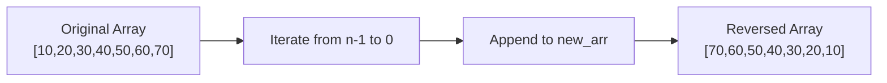
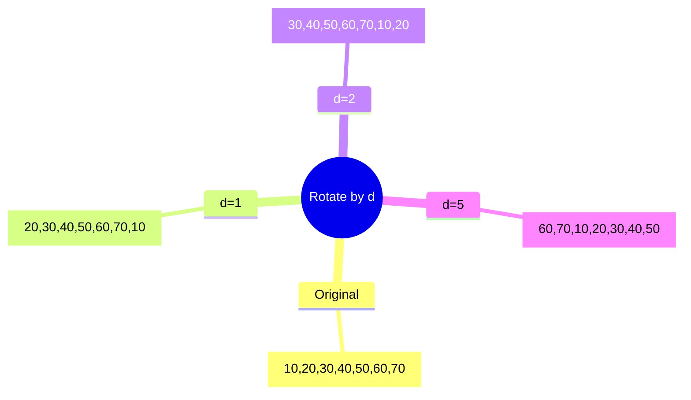
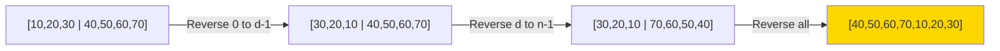
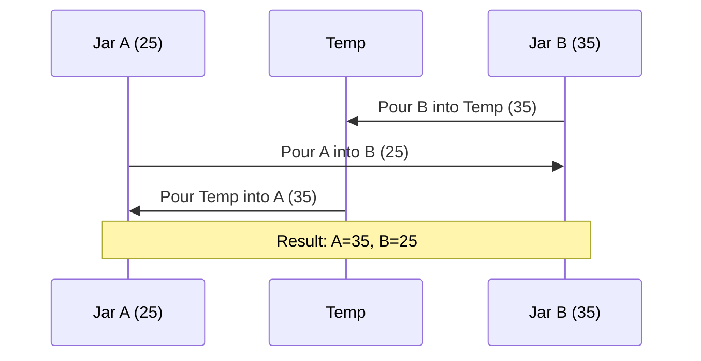

# 📚 Array Manipulation: Reverse & Rotate Arrays in Python

> Learn essential array manipulation techniques with optimized algorithms for reversing and rotating arrays

***

## 🎯 Problem Overview

This guide covers two fundamental **array manipulation problems**:
1. **Reversing an array** - Flipping element order
2. **Rotating an array by `d` positions** - Circular shifting of elements

Both problems demonstrate space-time tradeoff optimization techniques.[1][2][3]

---

## 🔄 Problem 1: Reverse an Array

### Initial Approach (Using Extra Space)

The **naive approach** creates a new array and copies elements in reverse order.[3]



#### Implementation

```python
def reverse_array(arr):
    new_arr = []
    n = len(arr)
    
    # Iterate from last to first
    for i in range(n-1, -1, -1):
        new_arr.append(arr[i])
    
    return new_arr

# Python shortcut (creates new array)
reversed_arr = arr[::-1]
```

**Drawback**: Creates a **new array** instead of modifying the original (Space: O(n)).[3]

***

### ✅ Optimized Approach (In-Place Reversal)

The **two-pointer swap technique** reverses the array without extra space.[3]

#### Algorithm Logic

| Step | Action | Indices Swapped |
|------|--------|----------------|
| 1 | Swap first & last | `arr ↔ arr[n-1]` |
| 2 | Swap second & second-last | `arr[1] ↔ arr[n-2]` |
| 3 | Continue until middle | `arr[i] ↔ arr[n-1-i]` |

```mermaid
flowchart TD
    A[Start: arr = [10,20,30,40,50,60,70]] --> B{i < n//2?}
    B -->|Yes| C["Swap arr[i] ↔ arr[n-1-i]"]
    C --> D[Increment i]
    D --> B
    B -->|No| E[Done: [70,60,50,40,30,20,10]]
    
    style E fill:#90EE90
```

#### Implementation

```python
def reverse_array(arr):
    n = len(arr)
    
    # Only iterate till middle
    for i in range(n // 2):
        # Swap using temporary variable
        temp = arr[i]
        arr[i] = arr[n-1-i]
        arr[n-1-i] = temp
    
    # Python swap shortcut (no temp variable needed)
    # arr[i], arr[n-1-i] = arr[n-1-i], arr[i]

# Example
arr = [10, 20, 30, 40, 50, 60, 70]
reverse_array(arr)
print(arr)  # [70, 60, 50, 40, 30, 20, 10]
```

### Complexity Analysis

| Metric | Naive Approach | Optimized Approach |
|--------|---------------|-------------------|
| **Time** | O(n) | O(n/2) ≈ O(n) |
| **Space** | O(n) | O(1) ⭐ |

The optimized approach achieves **constant space** by modifying in-place.[3]

---

## 🔁 Problem 2: Rotate Array by `d` Times

### Understanding Rotation

**Left rotation by `d`** moves first `d` elements to the end.[1]



**Key Insight**: Rotating by `n` times returns the original array (where `n` = array length).[1]

***

### Naive Approach (Repeated Single Rotations)

Perform **single left rotation `d` times**.[2]

#### Algorithm

```python
def rotate_array_naive(arr, n, d):
    for j in range(d):  # Repeat d times
        temp = arr[0]  # Store first element
        
        # Left shift all elements
        for i in range(n-1):
            arr[i] = arr[i+1]
        
        arr[n-1] = temp  # Place first at end

# Example
arr = [10, 20, 30, 40, 50, 60, 70, 80, 90]
d = 2
n = len(arr)
rotate_array_naive(arr, n, d)
print(arr)  # [30, 40, 50, 60, 70, 80, 90, 10, 20]
```

#### Complexity

| Metric | Value | Explanation |
|--------|-------|-------------|
| **Time** | O(n × d) = O(n²) worst case | Nested loops |
| **Space** | O(1) | In-place |

⚠️ **Problem**: Quadratic time complexity for large `d`.[2]

***

### ✅ Optimized Approach (Reversal Algorithm)

The **three-step reversal technique** achieves O(n) time.[1]

#### 💡 Core Concept

For `arr = ` with `d=3`:

| Step | Action | Result |
|------|--------|--------|
| 1 | Reverse first `d` elements | `` |
| 2 | Reverse remaining elements | `` |
| 3 | Reverse entire array | `` ✅ |



#### Implementation

```python
def reverse_subarray(arr, start, end):
    """Reverse array from start to end index"""
    diff = end - start
    
    for i in range(diff // 2 + 1):
        # Swap elements
        arr[start+i], arr[end-i] = arr[end-i], arr[start+i]

def rotate_array_optimized(arr, n, d):
    # Handle d > n cases
    d = d % n
    
    # Step 1: Reverse first d elements
    reverse_subarray(arr, 0, d-1)
    
    # Step 2: Reverse remaining elements
    reverse_subarray(arr, d, n-1)
    
    # Step 3: Reverse entire array
    reverse_subarray(arr, 0, n-1)

# Example
arr = [10, 20, 30, 40, 50, 60, 70, 80, 90]
d = 4
n = len(arr)
rotate_array_optimized(arr, n, d)
print(arr)  # [50, 60, 70, 80, 90, 10, 20, 30, 40]
```

### Complexity Comparison

| Approach | Time Complexity | Space Complexity |
|----------|----------------|------------------|
| **Naive** | O(n × d) → O(n²) | O(1) |
| **Optimized** | 3 × O(n) → **O(n)** ⚡ | O(1) |

The optimized approach performs **3 linear passes** regardless of `d` value.[2][1]

***

## 🔑 Key Concepts

### Swap Technique (Container Analogy)

To swap contents of two jars without mixing:[3]



```python
# Swap using temporary variable
temp = a
a = b
b = temp

# Python shortcut (tuple unpacking)
a, b = b, a
```

### Modulo Operation for Rotation

Rotating by multiples of array length returns the original array:[2]

```python
# Handle d > n cases
d = d % n  # If d=12 and n=9, effective rotation = 12 % 9 = 3
```

***

## 📊 Performance Summary

### Reverse Array

```
Before: [10, 20, 30, 40, 50, 60, 70]
After:  [70, 60, 50, 40, 30, 20, 10]

✅ Time: O(n)
✅ Space: O(1)
```

### Rotate Array by d=3

```
Before: [10, 20, 30, 40, 50, 60, 70]
After:  [40, 50, 60, 70, 10, 20, 30]

✅ Time: O(n) [Optimized from O(n²)]
✅ Space: O(1)
```

***

## 🎓 Learning Outcomes

**Core Techniques Mastered**:
- Two-pointer swap pattern for in-place array manipulation[3]
- Reversal algorithm for rotation optimization[1]
- Time-space tradeoff analysis (O(n) space → O(1) space)[3]
- Modulo arithmetic for cyclic operations[2]
- Nested loop elimination (O(n²) → O(n))[2]

**Algorithm Design Principles**:
- Prefer in-place modifications over auxiliary arrays
- Break complex problems into simpler sub-problems (reverse operations)
- Optimize by reducing iteration depth

***

## 🚀 Quick Reference

| Operation | Function Call | Complexity |
|-----------|---------------|------------|
| Reverse array | `reverse_array(arr)` | O(n) time, O(1) space |
| Rotate by d (naive) | `rotate_array_naive(arr, n, d)` | O(n²) time |
| Rotate by d (optimal) | `rotate_array_optimized(arr, n, d)` | O(n) time |

**Best Practice**: Always use the reversal algorithm for array rotation in production code.
