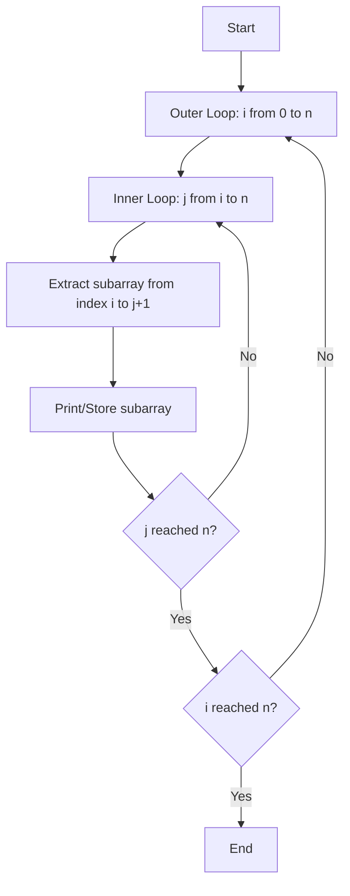
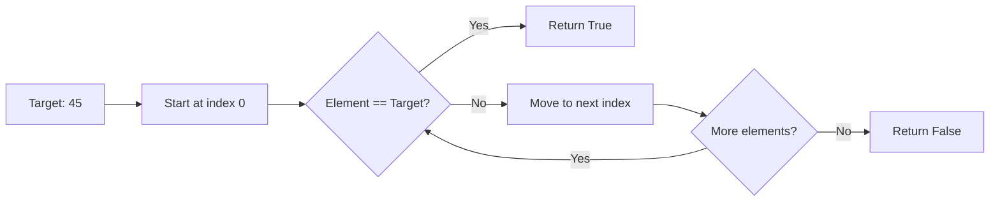
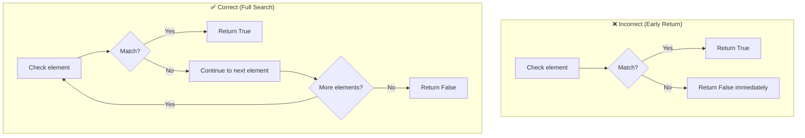

# 🚀 Array Operations: Subarrays & Linear Search

## 📋 Overview

This lecture covers two fundamental **array operations** in Python: generating all possible subarrays from an array and implementing linear search in an unsorted array.[1][2]

---

## 🎯 Problem 1: Generate All Subarrays

### What is a Subarray?

A **subarray** is a contiguous sequence of elements within an array. Elements must be continuous and cannot skip positions (e.g., `[1]` is not a valid subarray from `[1][2]`).[1]

### Example Breakdown

For array `[1][2]`, the possible subarrays are:[1]

| Starting Index | Subarrays Generated |
|----------------|---------------------|
| 0 | ``, ``, `` |
| 1 | ``, `` |
| 2 | `` |

### Algorithm Logic



### Python Implementation

```python
def generate_all_subarrays(array):
    n = len(array)
    
    # Outer loop: starting position
    for i in range(0, n):
        # Inner loop: ending position
        for j in range(i, n):
            # Print subarray from i to j+1 (using slicing)
            print(array[i:j+1])

# Example usage
arr = [1, 2, 3]
generate_all_subarrays(arr)
```

### 📊 Time Complexity Analysis

| Operation | Complexity | Explanation |
|-----------|-----------|-------------|
| Outer Loop | O(n) | Iterates through all starting positions |
| Inner Loop | O(n) | Iterates through all ending positions |
| **Total** | **O(n²)** | Nested loop structure |

### Key Points ⚡

The algorithm uses **two nested loops**: the outer loop `i` determines the starting index, while the inner loop `j` determines the ending index. Python's slice notation `array[i:j+1]` extracts elements from index `i` up to (but not including) `j+1`.[1]

***

## 🔍 Problem 2: Linear Search in Unsorted Array

### Problem Statement

Given a **target value** and an **unsorted array**, determine if the target exists in the array.[2]

### Search Process Visualization



### Algorithm Steps

<details>
<summary>💡 Why Return False Outside the Loop?</summary>

The `return False` statement must be **outside** the loop because we need to check ALL elements before concluding the target doesn't exist. If placed inside the loop, the function would return false after checking just the first element.[2]

</details>

### Python Implementation

```python
def find_element_in_array(arr, target):
    # Iterate through each element
    for el in arr:
        # If element matches target, return immediately
        if el == target:
            return True
    
    # If loop completes without finding target
    return False

# Example usage
array = [4, 2, 7, 5, 19]

# Test case 1: Element exists
target = 19
result = find_element_in_array(array, target)
print(result)  # Output: True

# Test case 2: Element doesn't exist
target = 10
result = find_element_in_array(array, target)
print(result)  # Output: False
```

### 📊 Performance Metrics

| Scenario | Time Complexity | When It Occurs |
|----------|----------------|----------------|
| Best Case | O(1) | Target is first element |
| Average Case | O(n/2) ≈ O(n) | Target in middle |
| Worst Case | O(n) | Target is last element or absent |
| Space Complexity | O(1) | No extra space needed |

### Control Flow Comparison



### Why Linear Search? 🤔

Linear search is necessary for **unsorted arrays** because elements don't follow any order. For sorted arrays, more efficient algorithms like binary search (O(log n)) can be used.[2]

---

## 🎓 Key Takeaways

| Concept | Subarrays | Linear Search |
|---------|-----------|---------------|
| **Input Type** | Any array | Unsorted array + target |
| **Output** | All contiguous subsequences | Boolean (found/not found) |
| **Time Complexity** | O(n²) | O(n) |
| **Use Case** | Analyzing all possible segments | Finding elements without order |
| **Loop Structure** | Nested loops | Single loop |

### Practice Tips 📝

Both algorithms demonstrate fundamental **iteration patterns**: nested loops for generating combinations and single-pass traversal for searching. Understanding why the `return False` statement must be outside the loop is crucial for avoiding premature function termination.[2][1]
