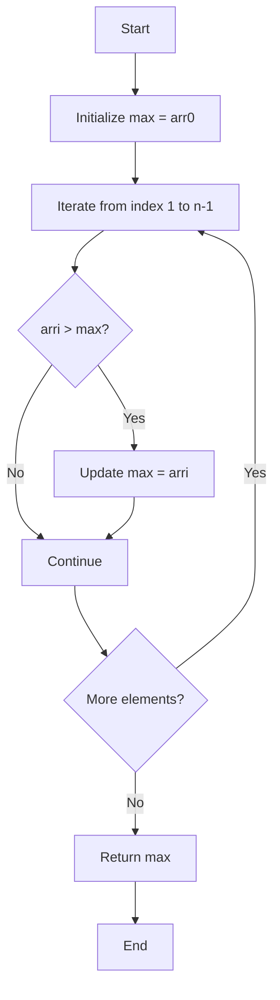
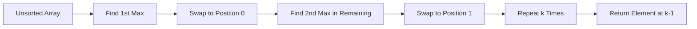

# K'th Smallest/Largest Element in Unsorted Array 🎯

> **Algorithm for finding the k-th smallest or largest element in an unsorted array using selection-based approach**

***

## 📌 Problem Overview

Finding maximum and minimum elements in an array, as well as the **k-th smallest** or **k-th largest** element without fully sorting the array. This approach uses iterative selection and swapping to partition elements.

| Problem Type | Time Complexity | Space Complexity | Approach |
|-------------|----------------|------------------|----------|
| Find Max/Min | O(n) | O(1) | Linear scan |
| K-th Largest | O(k × n) | O(1) | Partial selection sort |
| K-th Smallest | O(k × n) | O(1) | Partial selection sort |

[1]

***

## 🔍 Finding Maximum Element

The **maximum element** is found by assuming the first element is the max, then iterating through the array and updating whenever a larger element is found.[1]

### Algorithm

```python
def find_max(arr):
    n = len(arr)
    max_val = arr[0]  # Assume first element is maximum
    
    for i in range(1, n):
        if arr[i] > max_val:
            max_val = arr[i]  # Update max if current element is larger
    
    return max_val
```

### Process Flow



**Example:** For array `[45, 22, 12, -37, 5, -2, 72]`, the maximum is **72**.[1]

***

## 🔽 Finding Minimum Element

The **minimum element** follows the same logic but checks if the current element is **less than** the assumed minimum.[1]

### Algorithm

```python
def find_min(arr):
    n = len(arr)
    min_val = arr[0]  # Assume first element is minimum
    
    for i in range(1, n):
        if arr[i] < min_val:
            min_val = arr[i]  # Update min if current element is smaller
    
    return min_val
```

### Comparison Table

| Iteration | Current Element | Current Max | Updated? | Current Min | Updated? |
|-----------|----------------|-------------|----------|-------------|----------|
| 0 | 45 | 45 | Initial | 45 | Initial |
| 1 | 22 | 45 | No | 22 | Yes |
| 2 | 12 | 45 | No | 12 | Yes |
| 3 | -37 | 45 | No | -37 | Yes |
| 4 | 5 | 45 | No | -37 | No |
| 5 | -2 | 45 | No | -37 | No |
| 6 | 72 | 72 | Yes | -37 | No |

**Result:** Max = **72**, Min = **-37**.[1]

---

## 📊 K-th Largest Element

Finding the **k-th largest** element requires identifying the k largest elements and positioning them at the beginning of the array through repeated selection and swapping.[1]

### Concept

| K Value | Meaning | Example Result |
|---------|---------|----------------|
| k = 1 | 1st largest (maximum) | 72 |
| k = 2 | 2nd largest | 45 |
| k = 3 | 3rd largest | 22 |

### Algorithm

```python
def find_k_max(arr, n, k):
    for j in range(k):
        max_idx = j  # Start with current position
        
        # Find maximum in remaining unsorted portion
        for i in range(j + 1, n):
            if arr[i] > arr[max_idx]:
                max_idx = i
        
        # Swap maximum element to position j
        arr[j], arr[max_idx] = arr[max_idx], arr[j]
    
    return arr[k - 1]  # K-th largest is at index k-1
```

### Process Visualization



### Step-by-Step Example

For array `[45, 22, 12, -37, 5, -2, 72]` with **k = 2**:[1]

**Iteration 1 (j=0):**
- Find max in entire array: **72** at index 6
- Swap: `[72, 22, 12, -37, 5, -2, 45]`

**Iteration 2 (j=1):**
- Find max in `[22, 12, -37, 5, -2, 45]`: **45** at index 6
- Swap: `[72, 45, 12, -37, 5, -2, 22]`

**Result:** 2nd largest element is **45** at index 1.[1]

***

## 🔢 K-th Smallest Element

The **k-th smallest** element uses the same approach but finds the **minimum** element in each iteration instead of maximum.[1]

### Algorithm

```python
def find_k_min(arr, n, k):
    for j in range(k):
        min_idx = j  # Start with current position
        
        # Find minimum in remaining unsorted portion
        for i in range(j + 1, n):
            if arr[i] < arr[min_idx]:
                min_idx = i
        
        # Swap minimum element to position j
        arr[j], arr[min_idx] = arr[min_idx], arr[j]
    
    return arr[k - 1]  # K-th smallest is at index k-1
```

### Comparison: K-th Largest vs K-th Smallest

| Aspect | K-th Largest | K-th Smallest |
|--------|-------------|---------------|
| Comparison | `arr[i] > arr[max_idx]` | `arr[i] < arr[min_idx]` |
| Direction | Largest elements to front | Smallest elements to front |
| Result Position | Index k-1 | Index k-1 |
| Example (k=2) | 2nd largest: 45 | 2nd smallest: -2 |

***

## 🧮 Complete Implementation

```python
# Example array
arr = [45, 22, -3, 56, 12, 73, -5, -34]
n = len(arr)

# Find maximum
max_val = find_max(arr)
print(f"Maximum: {max_val}")  # Output: 73

# Find minimum
min_val = find_min(arr)
print(f"Minimum: {min_val}")  # Output: -34

# Find 2nd largest
k = 2
second_largest = find_k_max(arr.copy(), n, k)
print(f"2nd Largest: {second_largest}")  # Output: 56

# Find 3rd smallest
k = 3
third_smallest = find_k_min(arr.copy(), n, k)
print(f"3rd Smallest: {third_smallest}")  # Output: -3
```

***

## ⚠️ Edge Cases

| Edge Case | Constraint | Example |
|-----------|-----------|---------|
| Invalid K | `k > n` or `k < 1` | Array size is 8, but k = 20 |
| Empty Array | `n = 0` | No elements to process |
| Single Element | `n = 1` | Only valid for k = 1 |
| Duplicate Elements | Multiple same values | May affect ranking |

**Important:** Always validate that **1 ≤ k ≤ n** before executing the algorithm.[1]

---

## 🎯 Key Takeaways

- **Max/Min finding** uses single pass comparison with O(n) time complexity
- **K-th largest/smallest** uses partial selection sort with O(k × n) time complexity
- Elements are **swapped to front** positions to separate sorted from unsorted portions
- The k-th element is always at **index k-1** after k iterations
- This approach **modifies the original array** - use a copy if needed

```mermaid
mindmap
  root((Array Selection))
    Max/Min
      Single Pass
      O(n) Time
      Compare All
    K-th Largest
      Find Max K Times
      Swap to Front
      O(k×n) Time
    K-th Smallest
      Find Min K Times
      Swap to Front
      O(k×n) Time
    Edge Cases
      Invalid K
      Empty Array
      Duplicates
```

***

## 💡 Algorithm Summary

The selection-based approach efficiently finds k-th elements without fully sorting the array, making it optimal when **k << n** (k is much smaller than n). For better performance with larger k values, consider using heap-based or quickselect algorithms.[1]
Comprehensive GitHub-flavored notes on finding the maximum/minimum and the k-th smallest/largest elements in an unsorted array in Python are provided below, including diagrams, code, and comparison tables for multiple strategies.[1][2]

### Overview 📊
- The maximum and minimum of an array can be computed in one linear scan by tracking running bests, yielding time $$O(n)$$ and space $$O(1)$$.[1]
- The k-th order statistic (k-th smallest/largest) can be obtained via sorting, heap-based selection, or Quickselect, each with different complexity–accuracy tradeoffs.[2][3]

### Max/Min: One-Pass Scan 💡
- Initialize both `max_val` and `min_val` to the first element, then traverse the rest updating each when a larger or smaller element is found.[1]
- Complexity: time $$O(n)$$; space $$O(1)$$; pairwise-compare variants reduce comparisons to about $$3n/2$$ while keeping $$O(n)$$ time.[1]

```python
# Max/Min in one pass
def find_min_max(arr):
    if not arr:
        raise ValueError("empty array")
    max_val = arr[0]
    min_val = arr[0]
    for x in arr[1:]:
        if x > max_val:
            max_val = x
        elif x < min_val:
            min_val = x
    return max_val, min_val
# Rationale and O(n)/O(1) from standard linear scan.  [web:6]
```

> Tip: For fewer comparisons, compare elements in pairs and then update min/max, achieving roughly $$3n/2$$ comparisons with $$O(n)$$ time.[1]

```mermaid
flowchart LR
    A[Start: arr[0]] --> B[Set max=min=arr[0]]
    B --> C{For each x in arr[1..]}
    C -->|x > max| D[set max = x]
    C -->|elif x < min| E[set min = x]
    D --> C
    E --> C
    C -->|done| F[Return (max, min)]
```


### K-th Smallest/Largest: Strategies 🎯
- Sorting: sort array and index at $$k-1$$ for smallest or $$n-k$$ for largest; runs in $$O(n \log n)$$.[2]
- Heap selection: maintain a max-heap of size $$k$$ for k-th smallest (or min-heap for k-th largest), achieving $$O(n \log k)$$ time and $$O(k)$$ space.[2]
- Quickselect: partition like Quicksort but recurse only into the side containing the answer; expected $$O(n)$$ time, worst-case $$O(n^2)$$.[3]
- Partial selection (selection-by-swapping): perform k rounds of “select extremum and swap to front,” conceptually a partial selection sort on the first k positions.[4]

```python
# K-th smallest via heap (O(n log k))
import heapq

def kth_smallest_heap(arr, k):
    if not 1 <= k <= len(arr):
        raise ValueError("k out of range")
    max_heap = []
    for v in arr:
        heapq.heappush(max_heap, -v)
        if len(max_heap) > k:
            heapq.heappop(max_heap)
    return -max_heap[0]
# Approach and O(n log k) complexity.  [web:12]
```

```python
# Quickselect (expected O(n), worst O(n^2))
def partition(a, l, r):
    pivot = a[r]
    i = l
    for j in range(l, r):
        if a[j] <= pivot:
            a[i], a[j] = a[j], a[i]
            i += 1
    a[i], a[r] = a[r], a[i]
    return i

def quickselect(a, l, r, k_index):
    while True:
        if l == r:
            return a[l]
        p = partition(a, l, r)
        if k_index == p:
            return a[p]
        elif k_index < p:
            r = p - 1
        else:
            l = p + 1

def kth_smallest_quickselect(arr, k):
    if not 1 <= k <= len(arr):
        raise ValueError("k out of range")
    a = list(arr)
    return quickselect(a, 0, len(a)-1, k-1)
# Algorithm structure and complexities align with standard Quickselect.  [web:20]
```

```python
# Partial selection by swapping (k rounds), akin to selection-sort on prefix
def kth_largest_partial(arr, k):
    if not 1 <= k <= len(arr):
        raise ValueError("k out of range")
    a = list(arr)
    n = len(a)
    for j in range(k):  # place j-th largest at position j
        max_idx = j
        for i in range(j+1, n):
            if a[i] > a[max_idx]:
                max_idx = i
        a[j], a[max_idx] = a[max_idx], a[j]
    return a[k-1]
# Partial sorting concept for selecting order statistics.  [web:9]
```

```mermaid
flowchart LR
    S[Start j=0] --> T{j < k?}
    T -->|Yes| U[scan i=j+1..n-1 to locate index of current max]
    U --> V[swap a[j] <-> a[max_idx]]
    V --> W[increment j]
    W --> T
    T -->|No| X[Return a[k-1] (k-th largest)]
```


### Method Comparison Table 📑

| Approach | Time | Space | When it shines |
|---|---|---|---|
| Sorting | $$O(n \log n)$$  | $$O(1)$$ or $$O(n)$$ depending on sort  | Good when many selections are needed or sort is useful downstream  |
| Heap (size k) | $$O(n \log k)$$  | $$O(k)$$  | Stable performance when k is small relative to n  |
| Quickselect | Expected $$O(n)$$, worst $$O(n^2)$$  | $$O(1)$$ extra aside from recursion/iteration  | Fast in practice for single selection, average-case optimal  |
| Partial selection | $$O(nk)$$ typical for k rounds  | $$O(1)$$  | Simple to implement; fine for small k; avoids full sort  |

### Worked Usage Examples ✅
- To get second largest, run partial selection with $$k=2$$ and read `a[1]`, since positions $$0..k-1$$ hold the top-k in descending order after k rounds.[4]
- To get third smallest robustly on large arrays, prefer `kth_smallest_quickselect(arr, 3)` for expected linear performance.[3]

### Edge Cases ⚠️
- Ensure $$1 \le k \le n$$; k outside this range is undefined for order statistics and should raise an error.[2]
- For duplicates, “k-th smallest” is defined by sorted order, not uniqueness; Quickselect and heap approaches handle duplicates naturally.[3]

<details>
<summary>Why pairwise min/max cuts comparisons 💡</summary>
Scanning in pairs updates local min/max before global updates, reducing worst-case comparisons from about $$2(n-1)$$ to $$\approx 3n/2$$ while keeping $$O(n)$$ time and $$O(1)$$ space.[1]
</details>

### Quick Reference Table 📝

| Task | Best practical method | Complexity |
|---|---|---|
| Max/Min | One-pass scan | Time $$O(n)$$, Space $$O(1)$$  |
| K-th smallest | Quickselect (expected) | Time $$O(n)$$ avg, $$O(n^2)$$ worst  |
| K-th smallest (small k) | Max-heap of size $$k$$ | Time $$O(n \log k)$$, Space $$O(k)$$  |
| K-th largest (simple) | Partial selection by swapping | Time $$O(nk)$$, Space $$O(1)$$  |

