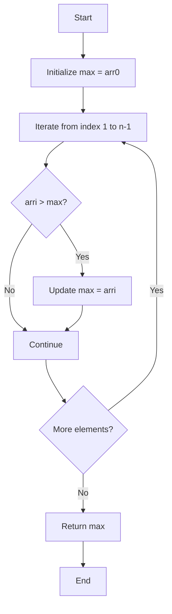
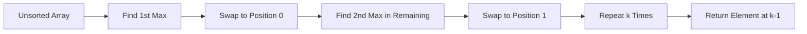

# K'th Smallest/Largest Element in Unsorted Array 🎯

> **Algorithm for finding the k-th smallest or largest element in an unsorted array using selection-based approach**

***

## 📌 Problem Overview

Finding maximum and minimum elements in an array, as well as the **k-th smallest** or **k-th largest** element without fully sorting the array. This approach uses iterative selection and swapping to partition elements.

| Problem Type | Time Complexity | Space Complexity | Approach |
|-------------|----------------|------------------|----------|
| Find Max/Min | O(n) | O(1) | Linear scan |
| K-th Largest | O(k × n) | O(1) | Partial selection sort |
| K-th Smallest | O(k × n) | O(1) | Partial selection sort |

[1]

***

## 🔍 Finding Maximum Element

The **maximum element** is found by assuming the first element is the max, then iterating through the array and updating whenever a larger element is found.[1]

### Algorithm

```python
def find_max(arr):
    n = len(arr)
    max_val = arr[0]  # Assume first element is maximum
    
    for i in range(1, n):
        if arr[i] > max_val:
            max_val = arr[i]  # Update max if current element is larger
    
    return max_val
```

### Process Flow



**Example:** For array `[45, 22, 12, -37, 5, -2, 72]`, the maximum is **72**.[1]

***

## 🔽 Finding Minimum Element

The **minimum element** follows the same logic but checks if the current element is **less than** the assumed minimum.[1]

### Algorithm

```python
def find_min(arr):
    n = len(arr)
    min_val = arr[0]  # Assume first element is minimum
    
    for i in range(1, n):
        if arr[i] < min_val:
            min_val = arr[i]  # Update min if current element is smaller
    
    return min_val
```

### Comparison Table

| Iteration | Current Element | Current Max | Updated? | Current Min | Updated? |
|-----------|----------------|-------------|----------|-------------|----------|
| 0 | 45 | 45 | Initial | 45 | Initial |
| 1 | 22 | 45 | No | 22 | Yes |
| 2 | 12 | 45 | No | 12 | Yes |
| 3 | -37 | 45 | No | -37 | Yes |
| 4 | 5 | 45 | No | -37 | No |
| 5 | -2 | 45 | No | -37 | No |
| 6 | 72 | 72 | Yes | -37 | No |

**Result:** Max = **72**, Min = **-37**.[1]

---

## 📊 K-th Largest Element

Finding the **k-th largest** element requires identifying the k largest elements and positioning them at the beginning of the array through repeated selection and swapping.[1]

### Concept

| K Value | Meaning | Example Result |
|---------|---------|----------------|
| k = 1 | 1st largest (maximum) | 72 |
| k = 2 | 2nd largest | 45 |
| k = 3 | 3rd largest | 22 |

### Algorithm

```python
def find_k_max(arr, n, k):
    for j in range(k):
        max_idx = j  # Start with current position
        
        # Find maximum in remaining unsorted portion
        for i in range(j + 1, n):
            if arr[i] > arr[max_idx]:
                max_idx = i
        
        # Swap maximum element to position j
        arr[j], arr[max_idx] = arr[max_idx], arr[j]
    
    return arr[k - 1]  # K-th largest is at index k-1
```

### Process Visualization



### Step-by-Step Example

For array `[45, 22, 12, -37, 5, -2, 72]` with **k = 2**:[1]

**Iteration 1 (j=0):**
- Find max in entire array: **72** at index 6
- Swap: `[72, 22, 12, -37, 5, -2, 45]`

**Iteration 2 (j=1):**
- Find max in `[22, 12, -37, 5, -2, 45]`: **45** at index 6
- Swap: `[72, 45, 12, -37, 5, -2, 22]`

**Result:** 2nd largest element is **45** at index 1.[1]

***

## 🔢 K-th Smallest Element

The **k-th smallest** element uses the same approach but finds the **minimum** element in each iteration instead of maximum.[1]

### Algorithm

```python
def find_k_min(arr, n, k):
    for j in range(k):
        min_idx = j  # Start with current position
        
        # Find minimum in remaining unsorted portion
        for i in range(j + 1, n):
            if arr[i] < arr[min_idx]:
                min_idx = i
        
        # Swap minimum element to position j
        arr[j], arr[min_idx] = arr[min_idx], arr[j]
    
    return arr[k - 1]  # K-th smallest is at index k-1
```

### Comparison: K-th Largest vs K-th Smallest

| Aspect | K-th Largest | K-th Smallest |
|--------|-------------|---------------|
| Comparison | `arr[i] > arr[max_idx]` | `arr[i] < arr[min_idx]` |
| Direction | Largest elements to front | Smallest elements to front |
| Result Position | Index k-1 | Index k-1 |
| Example (k=2) | 2nd largest: 45 | 2nd smallest: -2 |

***

## 🧮 Complete Implementation

```python
# Example array
arr = [45, 22, -3, 56, 12, 73, -5, -34]
n = len(arr)

# Find maximum
max_val = find_max(arr)
print(f"Maximum: {max_val}")  # Output: 73

# Find minimum
min_val = find_min(arr)
print(f"Minimum: {min_val}")  # Output: -34

# Find 2nd largest
k = 2
second_largest = find_k_max(arr.copy(), n, k)
print(f"2nd Largest: {second_largest}")  # Output: 56

# Find 3rd smallest
k = 3
third_smallest = find_k_min(arr.copy(), n, k)
print(f"3rd Smallest: {third_smallest}")  # Output: -3
```

***

## ⚠️ Edge Cases

| Edge Case | Constraint | Example |
|-----------|-----------|---------|
| Invalid K | `k > n` or `k < 1` | Array size is 8, but k = 20 |
| Empty Array | `n = 0` | No elements to process |
| Single Element | `n = 1` | Only valid for k = 1 |
| Duplicate Elements | Multiple same values | May affect ranking |

**Important:** Always validate that **1 ≤ k ≤ n** before executing the algorithm.[1]

---

## 🎯 Key Takeaways

- **Max/Min finding** uses single pass comparison with O(n) time complexity
- **K-th largest/smallest** uses partial selection sort with O(k × n) time complexity
- Elements are **swapped to front** positions to separate sorted from unsorted portions
- The k-th element is always at **index k-1** after k iterations
- This approach **modifies the original array** - use a copy if needed

```mermaid
mindmap
  root((Array Selection))
    Max/Min
      Single Pass
      O(n) Time
      Compare All
    K-th Largest
      Find Max K Times
      Swap to Front
      O(k×n) Time
    K-th Smallest
      Find Min K Times
      Swap to Front
      O(k×n) Time
    Edge Cases
      Invalid K
      Empty Array
      Duplicates
```

***

## 💡 Algorithm Summary

The selection-based approach efficiently finds k-th elements without fully sorting the array, making it optimal when **k << n** (k is much smaller than n). For better performance with larger k values, consider using heap-based or quickselect algorithms.[1]
