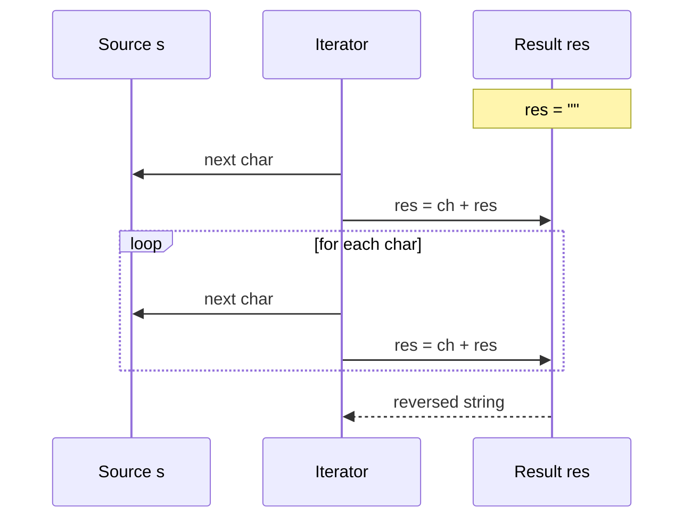

Here are GitHub-ready notes for a Python lecture covering how to print all substrings and how to reverse strings using loops and slicing, with examples, diagrams, and complexity insights below ✅📚[1][2]

### Overview 💡
- The session covers generating every possible **substring** of a string using nested loops and slicing, and reversing strings via concatenation or the `[::-1]` slice idiom in Python 📝[3][2][1]
- Core constraints emphasized include Python string **immutability** and why reversing builds a new string rather than modifying in place ⚠️[4][5]

### Print all substrings 📊
- The standard approach is two loops: pick a start index `i` in the outer loop, and an end index `j` in the inner loop, then emit `s[i:j]` for all `j` from `i+1` to `n` ✅[6][1]
- This systematically covers all substrings in lexicographic index order such as ['a','ab','abc','b','bc','c'] for "abc" 🎯[1]

```python
# Print all substrings of a string using nested loops
def print_all_substrings(s: str) -> None:
    n = len(s)
    for i in range(n):
        for j in range(i + 1, n + 1):
            print(s[i:j])
```

> Tip: Using `slice(i, j)` is equivalent to `s[i:j]` and can be handy for clarity in tooling or when constructing slices programmatically 🔧[1]

#### Flowchart: Substring generation
```mermaid
flowchart TD
  A[Start] --> B[Input string s of length n]
  B --> C[for i in 0..n-1]
  C --> D[for j in i+1..n]
  D --> E[output s[i:j]]
  E --> D
  D --> F{j done?}
  F -->|No| D
  F -->|Yes| G{i done?}
  G -->|No| C
  G -->|Yes| H[End]
```
- The outer loop fixes the start position; the inner loop sweeps end positions and prints `s[i:j]` for each valid pair 📤[6][1]

#### Table: Substring ranges for "abc"
| i (start)  | j (end, exclusive)  | s[i:j]  |
|---|---|---|
| 0  | 1  | "a"  |
| 0  | 2  | "ab"  |
| 0  | 3  | "abc"  |
| 1  | 2  | "b"  |
| 1  | 3  | "bc"  |
| 2  | 3  | "c"  |

### Reverse a string 🔄
- Because strings are immutable in Python, reversing must construct a new string either by iterative concatenation or by using the slicing trick `s[::-1]` ✅[2][5][3]
- The idiomatic approach is `s[::-1]` which uses a negative step to traverse from end to start efficiently and succinctly ⚡[7][3][2]

```python
# Method 1: Iterative concatenation (prepend)
def reverse_string_loop(s: str) -> str:
    res = ""
    for ch in s:
        res = ch + res
    return res

# Method 2: Pythonic slicing
def reverse_string_slice(s: str) -> str:
    return s[::-1]
```

#### Sequence (loop-based reverse)

- The loop version prepends each character to the accumulator, effectively mirroring the sequence from right to left 🧠[3][2]

> "Strings are immutable in Python; any apparent modification creates a new object." ⚠️[5][4]

### Method comparison ✅
| Approach  | Code  | Complexity  |
|---|---|---|
| Slicing  | `s[::-1]`  | $$O(n)$$ time, $$O(n)$$ space  |
| Loop prepend  | build `res = ch + res`  | $$O(n)$$ time, $$O(n)$$ space; may incur more allocations  |
| reversed()+join  | `"".join(reversed(s))`  | $$O(n)$$ time, $$O(n)$$ space; readable alternative  |

### Complexity and constraints ⚠️
- The number of substrings of a length $$n$$ string is $$n(n+1)/2$$, so printing them inherently takes $$\Theta(n^2)$$ outputs and cannot be done in $$O(n)$$ time ⏱️[8][6]
- Python strings are immutable; operations like concatenation or slicing produce new string objects rather than modifying the original 🔐[4][5]

### Worked examples 🧪
- For "abc": substrings = ["a","ab","abc","b","bc","c"] in index-sweep order as generated by nested loops ✅[1]
- For "abcdef": reversing yields "fedcba" via both loop-prepend and `[::-1]` methods equally correctly ✅[2][3]

### Troubleshooting & tips 🛠️
- Prefer **slicing** for clarity and performance in simple reverse-string tasks, keeping loop-prepend as an educational pattern or when customizing behavior 🎯[7][2]
- Use nested loops with `s[i:j]` (or `slice(i, j)`) to enumerate substrings deterministically without missing or duplicating ranges 📐[6][1]

<details>
<summary>More reversal techniques 🎒</summary>

- `reversed()` returns an iterator that can be joined: `"".join(reversed(s))`, which is readable and avoids manual concatenation ✅[2]
- `slice()` can emulate `[::-1]` by constructing an explicit slice object: `s[slice(None, None, -1)]` for reverse traversal 🔍[7]

</details>
