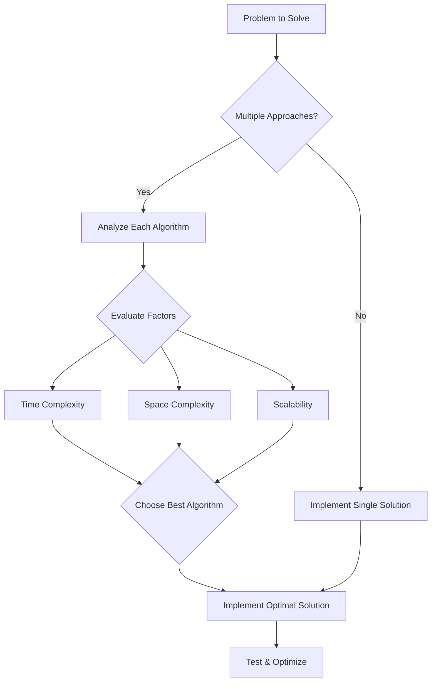
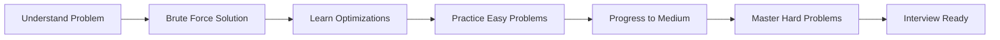

# 📚 Learn Data Structures and Algorithms in Python

**From Basic to Advance | A Beginner-Friendly Course**

## 🎯 Why Should You Learn DSA?

Data Structures and Algorithms (DSA) are fundamental skills that every programmer needs, regardless of their background or career goals. Whether you're a college graduate or working professional aiming for roles in software development, data analysis, or data science, DSA proficiency is essential for career advancement.

### The Interview Reality

When companies hire for specific roles (development, machine learning engineering, etc.), thousands of candidates apply with similar skill sets and projects. Organizations need a reliable method to identify the best candidates, and DSA serves as that differentiator.

**Companies prioritize candidates who demonstrate:**

- **Strong programming mindset** and critical thinking abilities
- **Problem-solving skills** to tackle complex, real-world challenges
- **Logical reasoning** to approach problems from multiple angles
- **Adaptability** when one solution doesn't perfectly fit the scenario

Most product-based companies set the first round as a DSA assessment, with many conducting two dedicated DSA interview rounds. This is why mastering DSA is non-negotiable for aspiring developers, regardless of technical or non-technical background.

### Beyond Interviews

While daily project work may not involve solving DSA problems directly, the knowledge helps developers think more clearly, write optimized code, and create scalable solutions. DSA principles enable you to choose efficient data structures and algorithms that enhance performance and eliminate future risks.

| **Skill Impact** | **Without DSA** | **With DSA** |
|---|---|---|
| Code Efficiency | Basic functional code | Optimized, scalable solutions |
| Problem Approach | Single solution attempt | Multiple approaches evaluated |
| Interview Success | Limited opportunities | Access to top tech companies |
| Career Options | Restricted to similar roles | Broader technical opportunities |

***

## 📊 What Are Data Structures?

A **data structure** is a specialized format for organizing, processing, retrieving, and storing data efficiently. The way data is structured directly impacts how quickly and effectively programs can access and manipulate that information.

### Real-World Analogy: Library System

Consider a college library with thousands of books. Without proper organization:[2]

- Books scattered randomly across shelves
- No categorization by subject or author
- Searching for specific books becomes time-consuming
- Space utilization is inefficient

With proper data structure (organized library system):

- Books categorized by subject in designated racks
- Each shelf allocated for specific topics
- Quick search and retrieval possible
- Optimal space utilization

### Practical Applications

| **Use Case** | **Data Structure** | **Purpose** |
|---|---|---|
| Social Media Feed | Stack/Queue | Display recent posts first |
| Dictionary/Contacts | Hash Map | Store and retrieve key-value pairs |
| File System | Tree | Hierarchical organization |
| Google Maps | Graph | Find shortest paths between locations |

## ⚙️ What Are Algorithms?

**Algorithms** are step-by-step instructions that dictate how data is processed to produce meaningful results. They define the logic for manipulating data within data structures to achieve desired outcomes.

### Travel Analogy: Route Selection

Imagine traveling from **Point A** to **Point B** with two options:

1. **Road travel** 🚗
2. **Flight travel** ✈️

You cannot simply say flying is always better—the optimal choice depends on **distance**:

- **Short distance**: Road travel is more practical and cost-effective
- **Long distance**: Flight saves significant time

### Library Search Example

When searching for a specific book in a library:

**Approach 1 (Linear Search):**
- Search one-by-one through every rack and shelf
- Time-consuming and inefficient

**Approach 2 (Optimized Search):**
- Navigate to the specific department section
- Locate the subject-specific rack
- Search only the relevant shelf with books by particular authors

The second approach demonstrates algorithmic thinking—breaking down the problem into smaller, manageable steps.[5][2]

### Algorithm Selection Principles

Different problems require different algorithmic approaches. The best algorithm considers:[6][5]

- **Time complexity**: How fast does it execute?
- **Space complexity**: How much memory does it consume?
- **Data size**: Does it scale with large datasets?
- **Problem constraints**: What are the specific requirements?

### Professional Background

Working as a **Full Stack Web Developer** at Vizuara with experience across multiple industries. Skills include:[12]

- **Frontend & Backend Technologies**: Building comprehensive web applications
- **Scalable Architecture**: Creating high-performance systems for millions of users
- **Machine Learning Projects**: Currently developing ML solutions at Vizuara

### Unique Journey

🎓 **Non-Tech Background**: Master's degree in Physics from University of Kolkata

**Career Transition:**
- Self-learned programming through online resources and tutorials
- Solved extensive DSA problems to build problem-solving skills
- Developed portfolio projects to demonstrate capabilities
- Successfully transitioned into software engineering

> **"If I can do it, you can do it too"** - The instructor's journey proves that dedication and consistent effort matter more than educational background.

## 📋 Course Content Overview

This comprehensive course covers essential data structures and algorithms from beginner to advanced levels.

### Data Structures Covered

| **Category** | **Topics** | **Real-World Applications** |
|---|---|---|
| **Linear** | List (Array), String | Database records, text processing |
| **Hash-Based** | Set, Dictionary | Unique collections, fast lookups |
| **Stack-Based** | Stack, Queue | Undo/redo, task scheduling |
| **Linked** | Linked List | Dynamic memory, music playlists |
| **Hierarchical** | Tree | File systems, organization charts |
| **Network** | Graph | Social networks, maps, routing |

### Algorithms Covered

1. ⚡ **Two Pointers Technique** - Efficient array/string traversal
2. 🪟 **Sliding Window** - Subarray/substring problems
3. 🔍 **Searching** - Linear and binary search methods
4. 📊 **Sorting** - Various sorting algorithms and optimization
5. 🔄 **Recursion** - Breaking problems into smaller subproblems
6. 🔙 **Backtracking** - Exploring all possible solutions
7. 💚 **Greedy Algorithms** - Making locally optimal choices
8. 🚀 **Dynamic Programming** - Optimizing overlapping subproblems

## 🎓 Learning Methodology

### Progressive Difficulty Approach

### Course Philosophy

**Step-by-Step Learning:**

1. **Foundation Building**: Start with problem-solving basics and brute force approaches
2. **Optimization Techniques**: Explore multiple ways to solve each problem
3. **Pattern Recognition**: Identify which approach is most efficient
4. **Difficulty Progression**: Easy → Medium → Hard LeetCode questions
5. **Interview Preparation**: Apply learned concepts to real coding interviews

### What Makes This Course Unique

| **Feature** | **Benefit** |
|---|---|
| 🐍 **Python-Focused** | Learn DSA with beginner-friendly syntax |
| 🎯 **No Prerequisites** | Taught from scratch, even for non-programmers |
| 💡 **Multiple Approaches** | Understand why certain solutions are better |
| 🏆 **Interview-Oriented** | Practice with actual coding interview questions |
| 🌟 **Non-CS Friendly** | Designed for learners from any background |

## ✅ Course Requirements

- ✅ **No Python knowledge required** - Taught from basics
- ✅ **No programming background needed** - Complete beginner-friendly
- ✅ **Non-CS background welcome** - Designed for all educational backgrounds
- ✅ **Dedication & consistency** - Commit to regular practice

### Success Formula

The only requirements for course success:

1. **Dedication** 🎯 - Commit to learning consistently
2. **Consistency** 📅 - Practice regularly, not sporadically
3. **Problem-solving mindset** 🧠 - Approach challenges with curiosity
4. **Patience** ⏳ - Master concepts progressively

## 🎬 Course Outcomes

After completing this course, you will:

✅ **Master DSA fundamentals** in Python from basic to advanced levels
✅ **Solve coding problems** on platforms like LeetCode with confidence
✅ **Crack technical interviews** at product-based companies
✅ **Approach new problems** systematically with multiple solution strategies
✅ **Write optimized code** that scales efficiently
✅ **Build a strong technical foundation** regardless of your background

## 🚀 Your Learning Journey Starts Here

This course transforms complete beginners into confident problem solvers capable of tackling complex DSA challenges. With structured lessons, practical examples, and progressive difficulty levels, mastering DSA becomes an enjoyable and rewarding journey.

**Remember**: Whether you're from a technical or non-technical background, DSA proficiency opens doors to top tech companies and high-paying roles in software development

> 💡 **Fun Learning Promise**: Problem-solving will become enjoyable as you progress through the course and witness your growth from basic concepts to advanced algorithmic thinking.

