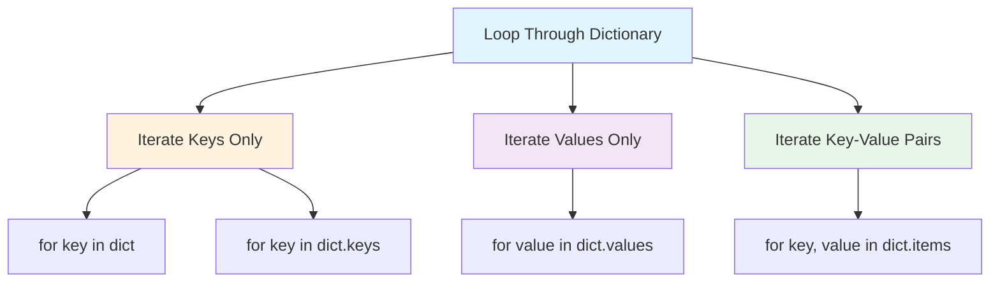
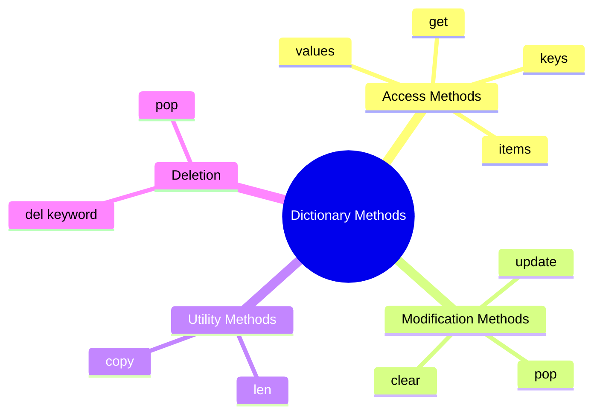
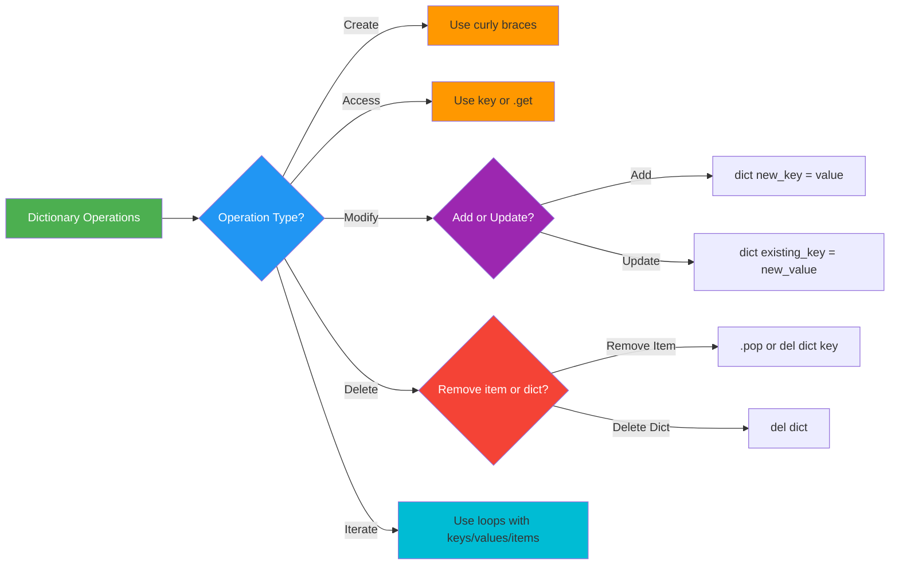

# 📚 Python Dictionaries - Complete Guide

> **Course**: Data Structures and Algorithms in Python  
> **Topic**: Dictionary Operations and Methods

## 📖 What is a Dictionary?

A **dictionary** in Python stores data in **key-value pairs**, unlike arrays or sets that store single values separated by commas. Each item in a dictionary consists of a unique key and its associated value.

**Key Characteristics:**
- Keys must be **unique** ✅
- Values can be **duplicated** ✅
- Created using curly braces `{}`
- Known as **HashMap** in other languages (e.g., Java)

```python
# Dictionary syntax
my_dict = {
    "key1": "value1",
    "key2": "value2",
    "key3": "value3"
}
```

## 🔧 Creating a Dictionary

```python
student = {
    "name": "John",
    "age": 21,
    "hobbies": ["reading", "swimming"]
}

print(student)
# Output: {'name': 'John', 'age': 21, 'hobbies': ['reading', 'swimming']}

print(type(student))
# Output: <class 'dict'>
```

**Value Types Supported:**
- Strings 📝
- Numbers 🔢
- Arrays/Lists 📋
- Nested dictionaries 🗂️

## 🔍 Accessing Dictionary Items

### Method 1: Square Bracket Notation

```python
# Access using key name
student["age"]  # Returns: 21
student["hobbies"]  # Returns: ['reading', 'swimming']
```

### Method 2: get() Method

```python
# Access using .get() method
student.get("name")  # Returns: "John"
student.get("age")  # Returns: 21
```

| Method | Syntax | Example |
|--------|--------|---------|
| **Square Bracket** | `dict[key]` | `student["name"]` |
| **get() Method** | `dict.get(key)` | `student.get("name")` |

## ➕ Adding and Updating Items

### Adding New Items

```python
# Add new key-value pair
student["city"] = "Delhi"
print(student)
# Output: {'name': 'John', 'age': 21, 'hobbies': ['reading', 'swimming'], 'city': 'Delhi'}
```

### Updating Existing Items

```python
# Update existing key
student["age"] = 35
print(student)
# Output: {'name': 'John', 'age': 35, 'hobbies': ['reading', 'swimming'], 'city': 'Delhi'}
```

## ✔️ Checking Key Existence

### Using `in` Keyword

```python
print("name" in student)  # Returns: True
print("blahblah" in student)  # Returns: False
```

### Using `not in` Keyword

```python
print("name" not in student)  # Returns: False (name exists)
print("grade" not in student)  # Returns: True (grade doesn't exist)
```

## 🔄 Looping Through Dictionaries



### Loop 1: Iterate Over Keys (Default)

```python
for key in student:
    print(key)
# Output: name, age, hobbies, city
```

### Loop 2: Iterate Over Keys and Access Values

```python
for key in student:
    print(student[key])
# Output: John, 35, ['reading', 'swimming'], Delhi
```

### Loop 3: Using `.keys()` Method

```python
for key in student.keys():
    print(key)
# Output: name, age, hobbies, city
```

### Loop 4: Using `.values()` Method

```python
for value in student.values():
    print(value)
# Output: John, 35, ['reading', 'swimming'], Delhi
```

### Loop 5: Using `.items()` Method (Key-Value Pairs)

```python
for key, value in student.items():
    print(key, value)
# Output:
# name John
# age 35
# hobbies ['reading', 'swimming']
# city Delhi
```

## 📊 Dictionary Methods Overview



### Core Methods Summary

| Method | Description | Returns | Example |
|--------|-------------|---------|---------|
| `len()` | Number of items | Integer | `len(student)` → `3` |
| `.keys()` | All keys | List of keys | `student.keys()` → `['name', 'age', 'hobbies']` |
| `.values()` | All values | List of values | `student.values()` → `['John', 21, [...]]` |
| `.items()` | Key-value pairs | List of tuples | `student.items()` → `[('name', 'John'), ...]` |
| `.pop(key)` | Remove specific key | Removed value | `student.pop('age')` → Removes age |
| `del dict[key]` | Delete specific key | None | `del student['name']` → Removes name |

### 1. `len()` Function

```python
print(len(student))  # Returns: 3
```

### 2. `.keys()` Method

```python
print(student.keys())
# Output: dict_keys(['name', 'age', 'hobbies'])
```

### 3. `.values()` Method

```python
print(student.values())
# Output: dict_values(['John', 21, ['reading', 'swimming']])
```

### 4. `.items()` Method

```python
print(student.items())
# Output: dict_items([('name', 'John'), ('age', 21), ('hobbies', ['reading', 'swimming'])])
```

### 5. `.pop()` Method

```python
student.pop("age")
print(student)
# Output: {'name': 'John', 'hobbies': ['reading', 'swimming']}
```

### 6. `del` Keyword

```python
# Delete specific item
del student["name"]
print(student)
# Output: {'age': 21, 'hobbies': ['reading', 'swimming']}

# Delete entire dictionary
del student  # Dictionary no longer exists
```

## 🎯 Dictionary Operations Flowchart



## 🔥 Key Takeaways

- **Dictionaries** store data as key-value pairs
- **Keys** must be unique; **values** can be duplicated
- Use **square brackets** or `.get()` to access values
- Use **`in`** keyword to check key existence
- **Loop methods**: `.keys()`, `.values()`, `.items()`
- **Common methods**: `len()`, `.pop()`, `del` keyword

## 💡 Comparison: Dictionary vs Other Data Structures

| Feature | Dictionary | List | Set |
|---------|-----------|------|-----|
| **Storage** | Key-value pairs | Indexed items | Unique items |
| **Order** | Ordered (Python 3.7+) | Ordered | Unordered |
| **Duplicates** | Keys: No, Values: Yes | Yes | No |
| **Access** | By key | By index | No direct access |
| **Mutability** | Mutable | Mutable | Mutable |
| **Syntax** | `{}` or `dict()` | `[]` or `list()` | `{}` or `set()` |

***

<details>
<summary>📌 Quick Reference Cheat Sheet</summary>

```python
# Create
d = {"key": "value"}

# Access
d["key"] or d.get("key")

# Add/Update
d["new_key"] = "value"

# Check
"key" in d

# Loop
for k, v in d.items():
    print(k, v)

# Methods
len(d), d.keys(), d.values(), d.items()
d.pop("key"), del d["key"]
```

</details>

***

**Next Steps:** Practice solving DSA problems using dictionary operations! 🚀
