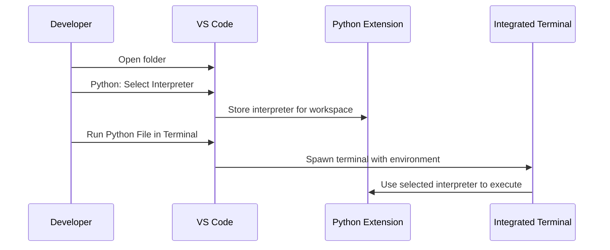

### Overview 📊
- The goal is to set up Python locally, run a first script, and choose a productive editor/IDE workflow for learning data structures and algorithms in Python.[1]
- The notes include step-by-step installs, verification commands, quick REPL usage, script execution, and editor tooling with PyCharm, Jupyter Notebook, Anaconda Navigator, and VS Code.

### Install Python ⚙️
- macOS and Windows installers are provided on the official Python Downloads page, which auto-detects the OS and offers the latest stable version.
- On Windows, installers include pip and optionally add the Python launcher and IDLE during setup, enabling a complete environment out of the box.

### Verify Installation ✅
- On macOS/Linux, verify with: `python3 --version` in Terminal to confirm the installed version.[1]
- On Windows, verify with either `python --version` or the launcher `py --version` in Command Prompt or PowerShell.[3]

### First Program in IDLE 💡
- IDLE is Python’s built-in editor and shell that ships with the standard Python installer, making it an easy place to write and run simple programs
- Launch IDLE, open the shell, and run `print("Hello, World!")`, or create a new file in the editor and press F5 to execute.

### Run Scripts from Terminal ⚡
- On macOS/Linux, place a script like `intro.py` in a folder and run it with `python3 intro.py` from that folder’s terminal.
- On Windows, run scripts from Command Prompt or PowerShell using `python intro.py` or the launcher `py intro.py`, not from inside the Python REPL.

> Important: Execute `.py` files from the system shell (cmd/PowerShell/Terminal), not from inside the interactive Python prompt.

### Windows Tips: The py Launcher ⚠️
- The Windows launcher `py` lets multiple Python versions coexist and allows selecting a specific version with switches like `py -3.11` or running scripts via `py script.py`.[3]
- Prefer `py` on Windows if multiple Python versions are installed to avoid PATH conflicts and ensure predictable execution.

### Jupyter Notebook 📝
- Install Jupyter with `pip install notebook` and start it with `jupyter notebook`, which opens a web-based environment ideal for data science workflows.
- Create a new Python 3 notebook, write a cell such as `print("Hello, world")`, and run it with Shift+Enter to see output inline.

### Anaconda Navigator 🚀
- Anaconda provides a distribution that bundles Python, Jupyter, and common data science libraries into an integrated environment for streamlined setup.
- Anaconda Navigator offers a GUI to launch tools like Jupyter and manage environments and packages without using the command line.

### VS Code Setup 🎯
- Install the Python extension and select the interpreter using the “Python: Select Interpreter” command from the Command Palette for correct execution and language features.
- VS Code’s integrated terminal runs the active interpreter, and “Run Python File in Terminal” respects the selected environment to execute scripts reliably.

### PyCharm (IDE) 🔥
- PyCharm is a full-featured Python IDE suitable for web, data, and AI/ML work, with free core features and an option to try Pro capabilities.
- Download and install PyCharm, then create a project, add a Python file, and use the green Run button to execute code with intelligent assistance and project tooling.

### macOS vs Windows quick commands
| Task | macOS/Linux | Windows |
|---|---|---|
| Verify version | `python3 --version`  | `python --version` or `py --version`  |
| Run a script | `python3 intro.py`  | `python intro.py` or `py intro.py`  |
| Start REPL | `python3`  | `py` or `python`  |

### Editors and tools comparison
| Tool | Type | Best for | Key notes |
|---|---|---|---|
| IDLE  | Editor + Shell | Beginners, quick scripts | Bundled with Python; F5 runs current file  |
| Jupyter Notebook  | Web notebook | Data science/ML | Install with pip; run `jupyter notebook`  |
| Anaconda Navigator  | Distribution/Launcher | Data workflows | Bundles Python, Jupyter, and libraries  |
| VS Code  | Editor + Ext | General dev | Use Python extension; select interpreter  |
| PyCharm  | Full IDE | Professional dev | Download IDE; create project and run  |

### Workflow flowchart (install to first run)
```mermaid
flowchart TD
  A[Download Python] --> B[Install (OS-detected)]
  B --> C{Windows?}
  C -- Yes --> D[Verify: py --version]
  C -- No --> E[Verify: python3 --version]
  D --> F[Open IDLE]
  E --> F[Open IDLE]
  F --> G[Create intro.py]
  G --> H[Run in IDLE (F5)]
  G --> I[Run in Terminal]
```

- The flow highlights download, install, verification, and two execution paths: IDLE or Terminal

### VS Code run sequence


- Selecting the interpreter ensures the terminal and language features use the same Python environment for reliable execution.[5]

### Essential commands (copy-ready)
```bash
# macOS/Linux verification
python3 --version
```
```powershell
# Windows verification
python --version
py --version
```
```bash
# Run a script (macOS/Linux)
python3 intro.py
```
```powershell
# Run a script (Windows)
python intro.py
py intro.py
```
```bash
# Jupyter install and launch
pip install notebook
jupyter notebook
```

### Troubleshooting and tips
- If VS Code doesn’t detect the environment, run “Python: Select Interpreter” and manually choose the correct path to the interpreter.
- If multiple Python versions exist on Windows, prefer `py` to target a specific version and avoid PATH issues.[3]

## Common pitfalls and fixes ⚠️

- Running `intro.py` inside the Python REPL will fail; exit the REPL and run from the shell like `py intro.py` on Windows or `python3 intro.py` on macOS/Linux.[3]

- After selecting an interpreter in VS Code, that choice persists for the workspace and drives both language services and run/debug behavior.[5]


[31](https://www.jetbrains.com/help/pycharm/installation-guide.html)
[32](https://www.youtube.com/watch?v=ZBGzx7-KjSM)
