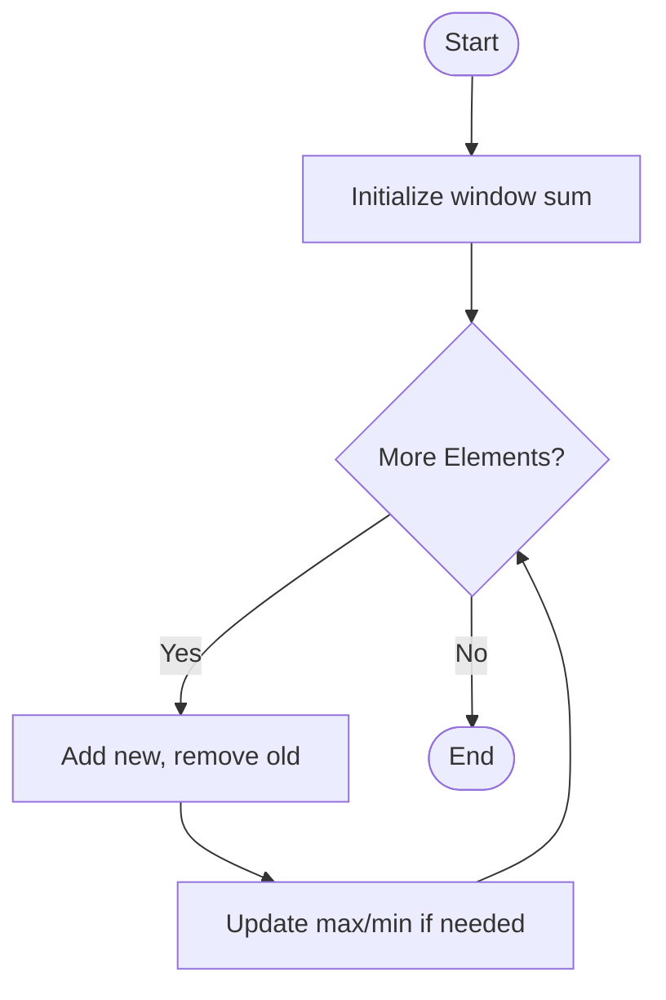

# 🚀 Sliding Window Technique: Notes

> **Sliding Window** is a technique (not an algorithm) used for solving optimization problems on lists and strings, especially when working with **consecutive elements** of a fixed or dynamic size.

## 💡 What is Sliding Window?
- The **sliding window** technique allows you to examine subarrays or substrings of a fixed size by moving a 'window' through the data -- one step at a time -- without fully recalculating values each time.
- This technique **reduces time complexity** by avoiding repeated work, making some brute-force solutions much faster.

### ✅ When To Use Sliding Window
| Criteria                | Description                                      | Example Problem                        |
|------------------------|--------------------------------------------------|----------------------------------------|
| **Continuous elements** | Sequence or substring must be consecutive        | Sum/max/min of k consecutive elements  |
| **Fixed size window**   | Question specifies a set length (like 'size k') | Largest sum of 3 adjacent elements     |
| **On arrays/strings**   | Most common for 1D data structures              | Longest substring without repeats      |

## ⚡ Brute-force vs. Sliding Window
<details>
<summary>Comparison Table</summary>

| Approach      | How It Works                                                      | Time Complexity  |
|--------------|--------------------------------------------------------------------|------------------|
| **Brute-force** | For every possible window, calculate sum from scratch               | $$ O(n \cdot k) $$   |
| **Sliding Window** | Calculate sum for first window, then update by adding new and removing old element | $$ O(n) $$           |
</details>

## 🎯 How Does Sliding Window Work?
- Maintain a running sum (or other metric) of the current window.
- On each step:
    - Add the new right-side element to the sum.
    - Subtract the old left-side element leaving the window.
- Repeat until you reach the end of the array.

### Example: Max Sum of Subarray of Size k
Given `arr = [6,2,3,9,[9][1][4]`, `k=3`:

| Step | Window   | Entering  | Exiting  | Current Sum | Max So Far |
|------|----------|-----------|----------|-------------|------------|
| 1    |   | 3         | -        | 11          | 11         |
| 2    |   | 9         | 6        | 14          | 14         |
| 3    | [1]  | 1         | 2        | 13          | 14         |
| 4    | [1]  | 4         | 3        | 14          | 14         |

## 🔥 Python Code Comparison
```python
# Brute Force
for i in range(n - k + 1):
    sum = 0
    for j in range(k):
        sum += arr[i + j]
    max_sum = max(max_sum, sum)
```

```python
# Sliding Window Approach
curr_sum = sum(arr[:k])
max_sum = curr_sum
for i in range(k, n):
    curr_sum += arr[i] - arr[i - k]
    max_sum = max(max_sum, curr_sum)
```

***
## 📊 Sliding Window: Time Complexity

| Approach         | Time Complexity        |
|------------------|-----------------------|
| **Brute Force**  | $$ O(n \cdot k) $$         |
| **Sliding Window** | $$ O(n) $$                 |

***
## Mermaid Flowchart: Sliding Window Steps


***
## Summary 🔥
- Use sliding window for problems needing consecutive sequences of fixed size.
- Dramatically improves performance vs. brute-force on large data.
- Recognize these problems by the need for 'subarrays/substrings of size k'.

🎯 **Your Turn:** Try explaining in your own words how the sliding window reduces redundant calculations compared to brute-force. Where else could you apply this technique?

***
If you want more tailored practice or examples, let me know your course or grade level! 📝

[1](https://www.youtube.com/watch?v=l6wQ0eeASWw&list=PLPTV0NXA_ZSgHj4a9CE1KLSarhkjocecO&index=31)
