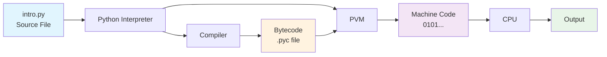
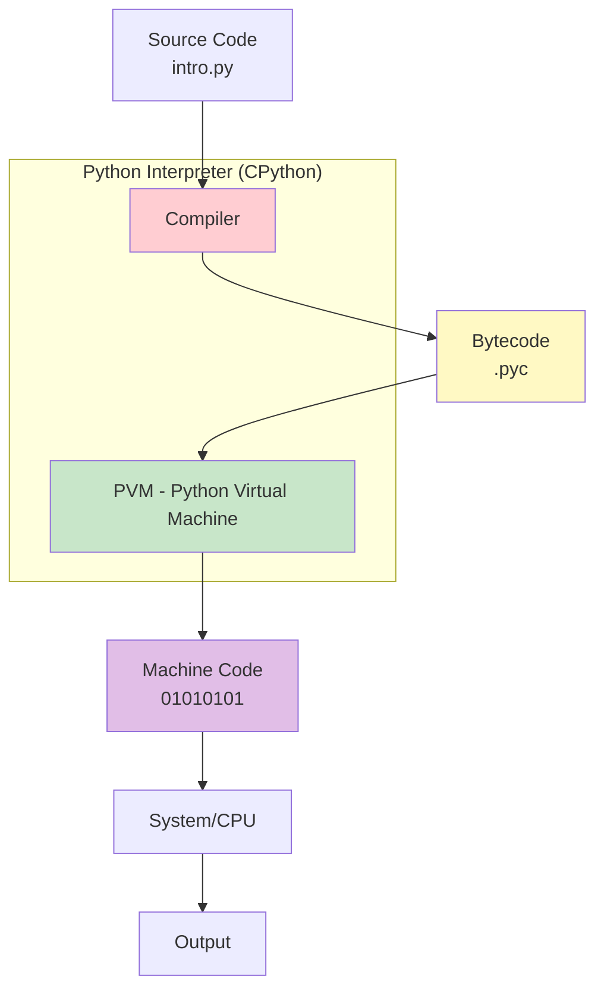
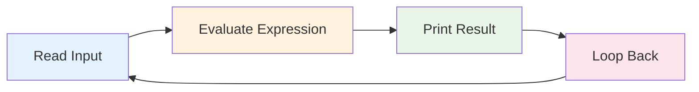
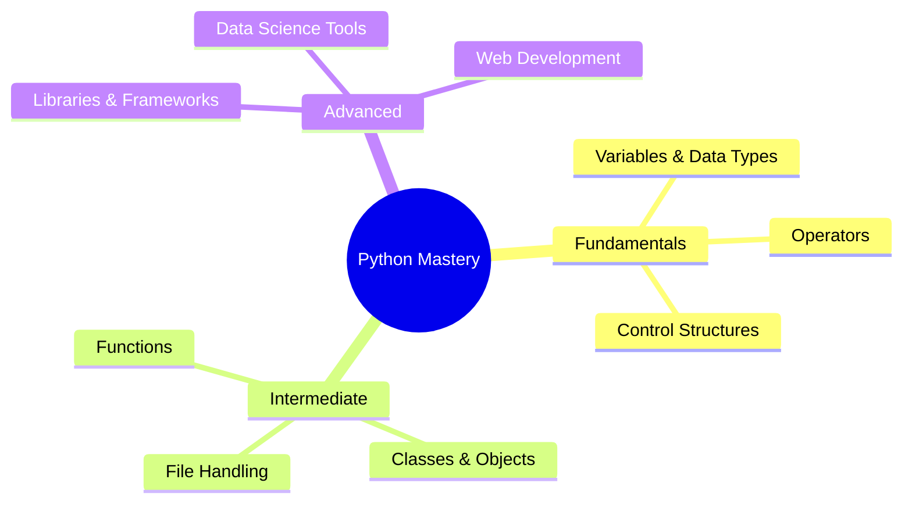

# 🐍 Introduction to Python: Basics, Advantages, Code Execution, Interpreter & REPL

## 📋 Table of Contents
- [What is Python?](#what-is-python)
- [Advantages of Python](#advantages-of-python)
- [Python Code Execution Process](#python-code-execution-process)
- [Python Interpreter Architecture](#python-interpreter-architecture)
- [Understanding REPL](#understanding-repl)
- [Key Concepts Summary](#key-concepts-summary)

***

## 🎯 What is Python?

**Python** is an **interpreted**, **object-oriented**, **high-level programming language** with **dynamic semantics**.

### 🔍 Key Characteristics

| Characteristic | Description |
|----------------|-------------|
| **Interpreted** | Executes code line by line, providing immediate feedback |
| **Object-Oriented** | Everything in Python is treated as an object |
| **Dynamic Semantics** | No need to declare variable types explicitly (unlike C, C++, Java) |
| **Creator** | Guido van Rossum |
| **Release Year** | 1991 |

### 🚀 Common Applications
- 🌐 **Web Applications**
- 💾 **Software Development** 
- 📊 **Data Science**
- 🤖 **Machine Learning**
- 🧠 **Artificial Intelligence**

***

## ⭐ Advantages of Python

| Advantage | Details |
|-----------|---------|
| 🌍 **Platform Independent** | Works on Windows, Mac, Linux, Raspberry Pi |
| 💰 **Free to Use** | No licensing fees required |
| 📝 **Easy Syntax** | Reads like English, requires fewer lines of code |
| 🐛 **Easy Debugging** | Interpreted nature makes debugging straightforward |
| 🔧 **Flexible Programming** | Supports both procedural and object-oriented approaches |
| 📚 **Rich Standard Library** | Extensive libraries for ML, data science, analytics, visualization |

***

## ⚙️ Python Code Execution Process



### 📋 Execution Steps

#### **Step 1: Syntax & Indentation Check** ✅
- Compiler checks for **indentation errors**
- Validates **syntax** (missing colons, parentheses, etc.)
- ⚠️ **If errors found**: Execution stops, no bytecode generated

#### **Step 2: Tokenization** 🔤
- Source code divided into **smaller chunks** called **tokens**
- Lexical tokens converted into **bytecode**

#### **Step 3: PVM Processing** ⚡
- **PVM (Python Virtual Machine)** converts bytecode into **executable code**
- Generates **binary code** (0s and 1s)
- Passes to **CPU** for execution

***

## 🏗️ Python Interpreter Architecture



### 🔧 Core Components

| Component | Function | Written In |
|-----------|----------|------------|
| **CPython** | Main Python interpreter | C Programming Language |
| **Compiler** | Converts source to bytecode | Part of interpreter |
| **PVM** | Runtime engine for bytecode execution | Part of interpreter |

***

## 🔄 Understanding REPL

**REPL** stands for **Read**, **Evaluate**, **Print**, **Loop** 💡

### 🎮 REPL Process Flow



### 📝 REPL Examples

```python
# Access Python REPL
$ python3

# Example 1: Simple number
>>> 8
8

# Example 2: Arithmetic operation
>>> 8 + 10
18

# Example 3: Multiplication
>>> 30 * 2
60

# Example 4: Modulo operation
>>> 20 % 3
2
```

### 🔄 REPL Workflow Breakdown

| Step | Action | Example |
|------|--------|---------|
| **Read** 📖 | Takes user input | `8 + 10` |
| **Evaluate** ⚡ | Processes the expression | Calculates: 8 + 10 = 18 |
| **Print** 🖨️ | Displays the result | Shows: `18` |
| **Loop** 🔄 | Ready for next input | Waits for new command |

***

## 📚 Key Concepts Summary

<details>
<summary><strong>🔍 Important Terms Glossary</strong></summary>

- **Interpreted Language**: Code executed line by line, not compiled beforehand
- **Dynamic Semantics**: Variable types determined at runtime, not declaration
- **Object-Oriented**: Everything treated as objects with properties and methods
- **Bytecode**: Intermediate code format between source and machine code
- **PVM**: Python Virtual Machine that executes bytecode
- **REPL**: Interactive shell for immediate code execution and testing

</details>

### ⚡ Quick Facts

> 🎯 **Python's Philosophy**: Write code that reads like English  
> 🚀 **Development Speed**: Fewer lines of code = faster development  
> 🔧 **Flexibility**: Supports multiple programming paradigms  
> 📦 **Rich Ecosystem**: Extensive library support for any task  

***

## 🎓 Learning Path Recommendations



### 🛠️ Next Steps
1. **Practice REPL commands** for immediate feedback
2. **Write simple Python scripts** to understand execution flow
3. **Explore Python's standard library** for built-in functionality
4. **Start with small projects** to apply learned concepts

**
