# 🐍 Python Basics: Variables, Data Types & Operators

> **Course:** Data Structures & Algorithms in Python  
> **Lecture 1:** Introduction to Python Fundamentals

***

## 📋 Table of Contents

- [Indentation in Python](#indentation-in-python)
- [Variables in Python](#variables-in-python)
- [Identifiers](#identifiers)
- [Data Types](#data-types)
- [Type Casting](#type-casting)
- [Operators](#operators)

***

## 🔲 Indentation in Python

Python uses **indentation** instead of curly braces `{}` to define code blocks. This is a fundamental difference from languages like C, C++, and Java.[1][2][3]

### Key Rules

- Use a **colon (`:`)** to start a code block
- Add **consistent spaces** (typically 4 spaces or 1 tab) before each line in the block
- The block ends when indentation returns to the previous level

```python
# Correct indentation
def example_function():
    x = 10  # 4 spaces
    y = 20  # 4 spaces
    return x + y  # 4 spaces

# Back to no indentation
result = example_function()
```

⚠️ **Important:** Unlike other languages, Python will throw an `IndentationError` if spacing is incorrect.[3]

***

## 💾 Variables in Python

**Variables** are temporary storage containers for data, and each variable points to a memory address where a Python object is stored.[4][5]

### How Variables Work


When you create a variable:

1. Python creates a **PyObject** in heap memory[4]
2. The object stores the **value**
3. The object has a unique **memory address**
4. The variable **name** points to that memory address[5]

### Variable Creation Examples

```python
# Integer variable
a = 20

# String variable
name = "John"

# List variable
hobbies = ["reading", "singing", "painting"]

# Check memory address
print(id(a))  # Output: 140234567891234 (example)
```

### 🔍 Memory Address Behavior

| Scenario | Memory Behavior | Example |
|----------|----------------|---------|
| **Same value, different variables** | Points to same memory address | `a = 20; b = 20` → same `id()` |
| **Different values** | Different memory addresses | `a = 20; b = 30` → different `id()` |
| **Same string** | Points to same memory address | `s1 = "Python"; s2 = "Python"` → same `id()` |
| **Different strings** | Different memory addresses | `s1 = "Python"; s2 = "Python2"` → different `id()` |

```python
# Example: Memory sharing
a = 20
b = 20
print(id(a) == id(b))  # True - both point to same object

# Example: Different memory
x = 20
y = 30
print(id(x) == id(y))  # False - different objects
```

### 🔄 Reference Counting

Python uses **reference counting** for memory management:[5]

```mermaid
graph TD
    A[Create: a = 20] --> B[PyObject: 20<br/>Ref Count: 1]
    C[Create: b = a] --> B
    B --> D[Ref Count: 2]
    E[Delete: del a] --> F[Ref Count: 1]
    G[Delete: del b] --> H[Ref Count: 0<br/>🗑️ Garbage Collected]
```



***

## 🏷️ Identifiers

**Identifiers** are names given to variables, functions, classes, or other objects.[3]

### Naming Rules

| Rule | ✅ Valid | ❌ Invalid |
|------|---------|----------|
| Start with letter or underscore | `name`, `_id`, `var1` | `1var`, `3name` |
| Can contain letters, digits, underscore | `user_name`, `value2` | `user-name`, `val@ue` |
| Case-sensitive | `age`, `Age`, `AGE` (all different) | — |
| No Python keywords | `my_class`, `func` | `class`, `for`, `if` |

```python
# Valid identifiers
language_1 = "Python"
_temp = 100
userName = "Alice"

# Invalid identifiers
# 3var = 10        # SyntaxError: starts with number
# user-name = ""   # SyntaxError: contains hyphen
# for = 5          # SyntaxError: Python keyword
```

### Python Reserved Keywords

```
and     as      assert   break    class    continue   def
del     elif    else     except   False    finally    for
from    global  if       import   in       is         lambda
None    not     or       pass     raise    return     try
True    while   with     yield
```

***

## 📊 Data Types

Python has **built-in data types** that are automatically assigned based on the value.[6][3]

### Data Type Categories


### Core Data Types Overview

| Data Type | Description | Example | Mutable? |
|-----------|-------------|---------|----------|
| **int** | Integer numbers | `500`, `-3`, `0` | ❌ |
| **float** | Decimal numbers | `3.14`, `-4.5` | ❌ |
| **bool** | True/False values | `True`, `False` | ❌ |
| **str** | Text/characters | `"Hello"`, `'Python'` | ❌ |
| **list** | Ordered collection | ``, `["a", "b"]` | ✅ |
| **tuple** | Immutable ordered collection | `(1, 2, 3)` | ❌ |
| **dict** | Key-value pairs | `{"name": "John", "age": 25}` | ✅ |
| **set** | Unordered unique elements | `{1, 2, 3}` | ✅ |

### Type Checking

```python
# Check variable type
v1 = 20
name = "John"
hobbies = ["reading", "hiking"]

print(type(v1))       # <class 'int'>
print(type(name))     # <class 'str'>
print(type(hobbies))  # <class 'list'>
```

### Detailed Examples

```python
# Integer
age = 25
temperature = -5

# Float
pi = 3.14159
price = 99.99

# Boolean
is_active = True
has_permission = False

# String
message = "Hello, World!"
name = 'Python'

# List (mutable)
fruits = ["apple", "banana", "orange"]
numbers = [1, 2, 3, 4, 5]

# Tuple (immutable)
coordinates = (10, 20)
rgb = (255, 128, 0)

# Dictionary
user = {"name": "Alice", "age": 30, "city": "NYC"}

# Set
unique_numbers = {1, 2, 3, 4, 5}
```

***

## 🔄 Type Casting

**Casting** converts a variable from one data type to another.[6][3]

### Common Casting Functions

```mermaid
flowchart LR
    A[Original Value] --> B{Casting Function}
    B -->|int()| C[Integer]
    B -->|float()| D[Float]
    B -->|str()| E[String]
    B -->|bool()| F[Boolean]
    B -->|list()| G[List]
```

### Casting Examples

```python
# Integer to String
v1 = 30
v2 = str(v1)
print(type(v1))  # lass 'intnt'>
print(type(v2))  # lassss 'str'>

# String to Integer
num = int("100")
print(num + 50)  # 150

# Float to Integer
price = 99.99
price_int = int(price)
print(price_int)  # 99 (truncates decimal)

# String to Float
value = float("3.14")
print(value)  # 3.14
```

### 📥 Casting with User Input

By default, `input()` returns a **string**:[3]

```python
# Without casting - returns string
num = input("Enter a number: ")
print(type(num))  # lassss 'str'>

# With casting - converts to integer
num = int(input("Enter a number: "))
print(type(num))  # lassss 'int'>
print(num + 10)   # Works: performs addition

# For float input
price = float(input("Enter price: "))
print(type(price))  # lass ' 'float'>
```

***

## ⚙️ Operators

Operators perform operations on variables and values.[7][8]

### Operator Categories

1. **Arithmetic** - Mathematical operations
2. **Comparison** - Compare values
3. **Logical** - Combine conditions
4. **Bitwise** - Bit-level operations
5. **Assignment** - Assign/modify values

***

### 🧮 Arithmetic Operators

| Operator | Name | Example | Result | Description |
|----------|------|---------|--------|-------------|
| `+` | Addition | `10 + 5` | `15` | Adds two values |
| `-` | Subtraction | `10 - 5` | `5` | Subtracts right from left |
| `*` | Multiplication | `10 * 5` | `50` | Multiplies values |
| `/` | Division | `10 / 5` | `2.0` | Always returns float |
| `%` | Modulus | `10 % 3` | `1` | Returns remainder |
| `**` | Exponentiation | `2 ** 3` | `8` | Power operation |
| `//` | Floor Division | `10 // 3` | `3` | Returns integer quotient |

```python
x = 20
y = 6

print(x + y)   # 26
print(x - y)   # 14
print(x * y)   # 120
print(x / y)   # 3.3333... (float)
print(x // y)  # 3 (floor division)
print(x % y)   # 2 (remainder)
print(x ** 2)  # 400 (20 squared)
```

***

### ⚖️ Comparison Operators

Return `True` or `False`:[8][7]

| Operator | Meaning | Example | Result |
|----------|---------|---------|--------|
| `==` | Equal to | `5 == 5` | `True` |
| `!=` | Not equal | `5 != 3` | `True` |
| `>` | Greater than | `10 > 5` | `True` |
| `<` | Less than | `5 < 10` | `True` |
| `>=` | Greater or equal | `5 >= 5` | `True` |
| `<=` | Less or equal | `5 <= 3` | `False` |

```python
x = 10
y = 5

print(x == y)   # False
print(x != y)   # True
print(x > y)    # True
print(x < y)    # False
print(x >= 10)  # True
print(x <= 5)   # False
```

***

### 🔗 Logical Operators

Combine conditional statements:[9][7]

| Operator | Description | Example | Result |
|----------|-------------|---------|--------|
| `and` | Both conditions must be True | `True and False` | `False` |
| `or` | At least one condition True | `True or False` | `True` |
| `not` | Reverses the condition | `not True` | `False` |

```python
x = 10

# AND - both must be True
print(x > 5 and x < 15)   # True (10 > 5 AND 10 < 15)
print(x > 5 and x < 8)    # False (10 is not < 8)

# OR - at least one must be True
print(x < 5 or x > 8)     # True (10 > 8 is True)
print(x < 5 or x < 8)     # False (both are False)

# NOT - reverses result
print(not(x > 5))         # False (reverses True)
```

### Truth Table

| A | B | A and B | A or B | not A |
|---|---|---------|--------|-------|
| T | T | T | T | F |
| T | F | F | T | F |
| F | T | F | T | T |
| F | F | F | F | T |

***

### 🔢 Bitwise Operators

Operate on binary representations:[7][9]

| Operator | Name | Description |
|----------|------|-------------|
| `&` | AND | Sets bit to 1 if both bits are 1 |
| `\|` | OR | Sets bit to 1 if at least one bit is 1 |
| `^` | XOR | Sets bit to 1 if bits are different |
| `~` | NOT | Inverts all bits |
| `<<` | Left Shift | Shifts bits left |
| `>>` | Right Shift | Shifts bits right |

#### Bitwise AND Example

```python
x = 6   # Binary: 110
y = 3   # Binary: 011

result = x & y  # Binary: 010 = 2

# Step-by-step:
# 1 & 0 = 0
# 1 & 1 = 1
# 0 & 1 = 0
print(result)  # 2
```

#### Bitwise OR Example

```python
x = 6   # Binary: 110
y = 3   # Binary: 011

result = x | y  # Binary: 111 = 7

# Step-by-step:
# 1 | 0 = 1
# 1 | 1 = 1
# 0 | 1 = 1
print(result)  # 7
```

#### Bitwise XOR Example

```python
x = 6   # Binary: 110
y = 3   # Binary: 011

result = x ^ y  # Binary: 101 = 5

# Step-by-step (1 if different):
# 1 ^ 0 = 1
# 1 ^ 1 = 0
# 0 ^ 1 = 1
print(result)  # 5
```

***

### 📝 Assignment Operators

Assign and modify variable values:[8][7]

| Operator | Example | Equivalent To | Description |
|----------|---------|---------------|-------------|
| `=` | `x = 5` | — | Assigns value |
| `+=` | `x += 3` | `x = x + 3` | Add and assign |
| `-=` | `x -= 3` | `x = x - 3` | Subtract and assign |
| `*=` | `x *= 3` | `x = x * 3` | Multiply and assign |
| `/=` | `x /= 3` | `x = x / 3` | Divide and assign |
| `%=` | `x %= 3` | `x = x % 3` | Modulus and assign |
| `**=` | `x **= 2` | `x = x ** 2` | Exponent and assign |
| `//=` | `x //= 3` | `x = x // 3` | Floor divide and assign |

```python
# Basic assignment
x = 10
print(x)  # 10

# Add and assign
x += 5    # x = x + 5
print(x)  # 15

# Subtract and assign
x -= 5    # x = x - 5
print(x)  # 10

# Multiply and assign
x *= 5    # x = x * 5
print(x)  # 50

# Modulus and assign
x = 10
x %= 3    # x = x % 3
print(x)  # 1 (remainder of 10/3)
```

***

## 🎯 Key Takeaways

✅ **Indentation is mandatory** in Python - use consistent spacing (4 spaces recommended)[3]
✅ **Variables don't need type declarations** - Python infers types automatically[3]
✅ **Multiple variables can point to the same memory** if values are identical[5]
✅ **Casting converts data types** - essential for user input handling[3]
✅ **Operators enable computations** - arithmetic, comparison, logical, bitwise, and assignment[7]

***

## 📚 Summary

This lecture covered Python fundamentals including:

- **Indentation rules** for code blocks
- **Variable creation** and memory management
- **Identifier naming conventions** and restrictions
- **Built-in data types** (numeric, sequence, mapping, boolean)
- **Type casting** for data conversion
- **Five operator categories** with practical examples

These concepts form the foundation for data structures and algorithms in Python.[10][2][1]

***

<details>
<summary>💡 Pro Tips</summary>

- Use `type()` to check variable types during debugging
- Use `id()` to verify memory addresses
- Prefer `//` over `/` when you need integer division
- Remember: strings, tuples, and numbers are **immutable**
- Lists, dictionaries, and sets are **mutable**
- Always cast user input to the appropriate type before processing

</details>

---

**Next Lecture:** Deep dive into Python collections (Lists, Tuples, Dictionaries, Sets) 🚀
