# Python Flow Control, Loops, and Functions - Comprehensive Notes

## Table of Contents
1. [Introduction to Flow Control](#introduction-to-flow-control)
2. [Conditional Statements](#conditional-statements)
3. [Looping Statements](#looping-statements)
4. [Break and Continue](#break-and-continue)
5. [Functions](#functions)
6. [Lambda Functions](#lambda-functions)
7. [Variable Scope](#variable-scope)


## 1. Introduction to Flow Control

**Flow Control** in Python determines the order in which code executes based on conditions and repetition requirements.

### Types of Flow Control

| Type | Purpose | Keywords |
|------|---------|----------|
| **Conditional Statements** | Execute code based on conditions | `if`, `elif`, `else` |
| **Looping Statements** | Repeat code multiple times | `while`, `for` |


## 2. Conditional Statements

Conditional statements (decision-making statements) perform tasks based on whether certain conditions are **True** or **False**.

### 2.1 If-Else Statement

#### Basic Syntax

```python
if condition:
    statement1  # Executes if condition is True
else:
    statement2  # Executes if condition is False
```

#### Flow Diagram

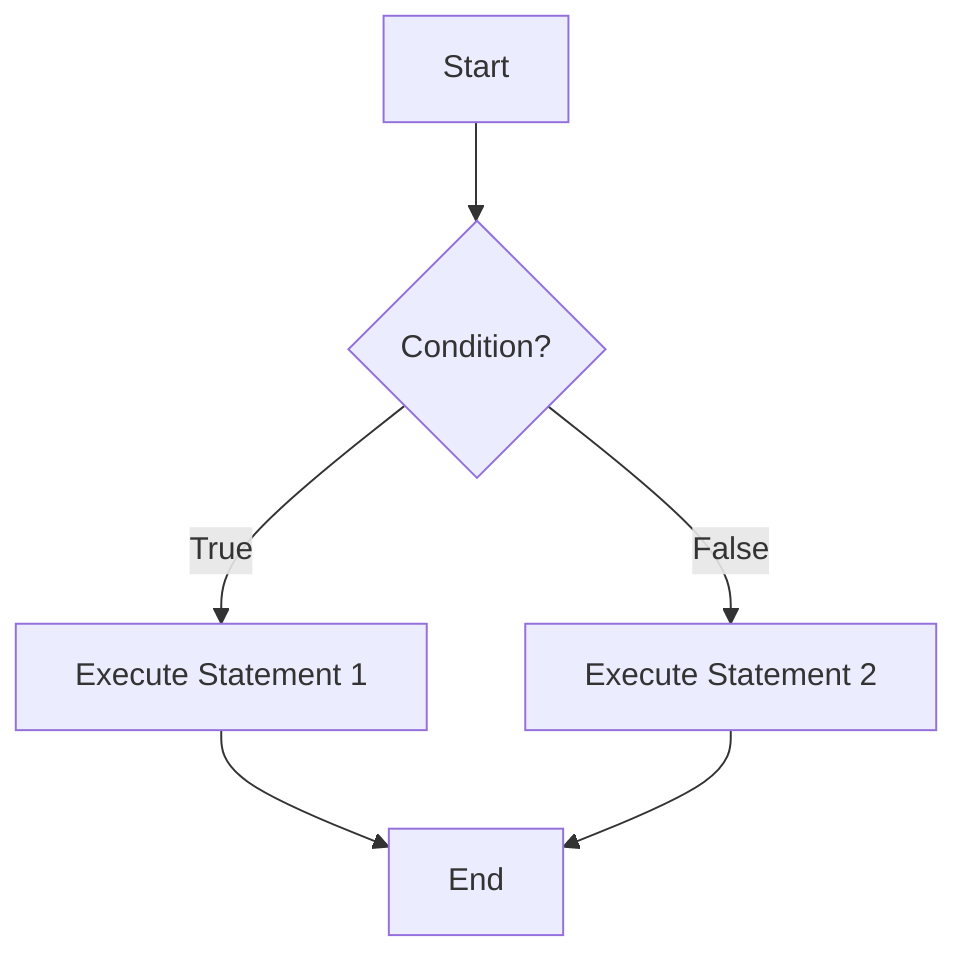
```mermaid
flowchart TD
    A[Start] --> B{Condition?}
    B -->|True| C[Execute Statement 1]
    B -->|False| D[Execute Statement 2]
    C --> E[End]
    D --> E
```

#### Example 1: Check Even or Odd Number

```python
num = 20

if num % 2 == 0:
    print("This is an even number")
else:
    print("This is an odd number")
```

**Output:** `This is an even number`

**Explanation:**
- The condition `num % 2 == 0` checks if the number is divisible by 2
- If remainder is 0, the number is even
- Otherwise, it's odd

### 2.2 If-Elif-Else Statement

When there are **multiple conditions** to check, we use `elif` (else if).

#### Syntax

```python
if condition1:
    statement1
elif condition2:
    statement2
elif condition3:
    statement3
else:
    statement4
```

#### Flow Diagram

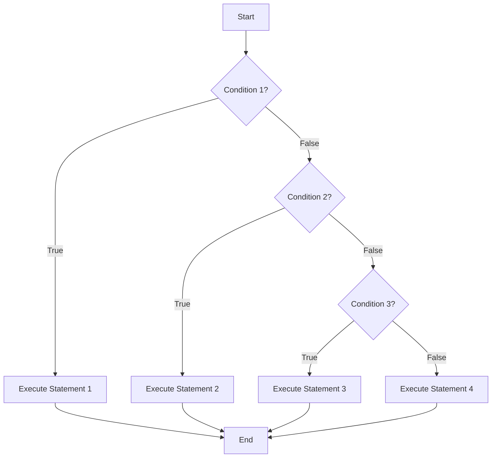
```mermaid
flowchart TD
    A[Start] --> B{Condition 1?}
    B -->|True| C[Execute Statement 1]
    B -->|False| D{Condition 2?}
    D -->|True| E[Execute Statement 2]
    D -->|False| F{Condition 3?}
    F -->|True| G[Execute Statement 3]
    F -->|False| H[Execute Statement 4]
    C --> I[End]
    E --> I
    G --> I
    H --> I
```

#### Example 2: Game Score Comparison

```python
your_score = 40
friend_score = 60

if your_score > friend_score:
    print("You win")
elif friend_score > your_score:
    print("Friend wins")
else:
    print("Tie")
```

**Output:** `Friend wins`

**Logic Flow:**

| Condition | Result |
|-----------|--------|
| your_score (40) > friend_score (60) | False |
| friend_score (60) > your_score (40) | **True** → Execute |
| Both equal | Not checked |


#### Example 3: FizzBuzz Problem

```python
num = 30

if num % 15 == 0:
    print("FizzBuzz")
elif num % 5 == 0:
    print("Fizz")
elif num % 3 == 0:
    print("Buzz")
else:
    print(num)
```

**Test Cases:**

| Number | Divisible by 15? | Divisible by 5? | Divisible by 3? | Output |
|--------|------------------|-----------------|-----------------|--------|
| 30 | ✓ Yes | - | - | FizzBuzz |
| 20 | ✗ No | ✓ Yes | - | Fizz |
| 21 | ✗ No | ✗ No | ✓ Yes | Buzz |
| 22 | ✗ No | ✗ No | ✗ No | 22 |

**Important:** Once a condition is satisfied, the corresponding block executes and the remaining conditions are **skipped**.


## 3. Looping Statements

Loops are used to perform **repetitive tasks** without writing the same code multiple times.

### Why Use Loops?

**Problem:** Print "Hello World" 1000 times

❌ **Without Loop:** Write `print("Hello World")` 1000 times  
✅ **With Loop:** Write loop code once, execute 1000 times

### Comparison: While vs For Loop

| Feature | While Loop | For Loop |
|---------|-----------|----------|
| **Syntax Complexity** | More complex | Simpler |
| **Initialization** | Manual | Automatic |
| **Increment/Decrement** | Manual | Automatic |
| **Use Case** | Unknown iterations | Known iterations |
| **Infinite Loop Risk** | Higher (if increment forgotten) | Lower |

### 3.1 While Loop

A **while loop** repeats code as long as a condition remains **True**.

#### Syntax

```python
initialization
while condition:
    statement(s)
    increment/decrement
```

#### Flow Diagram

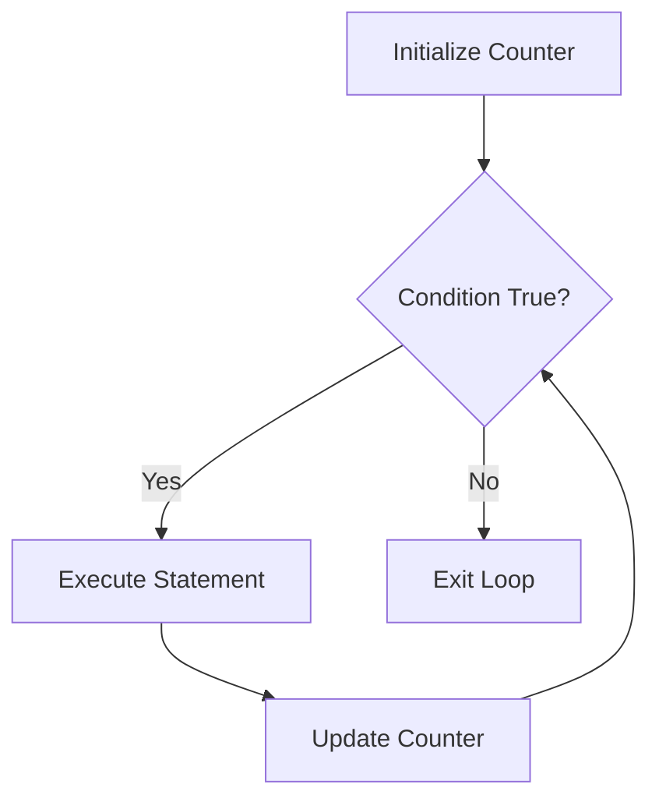
```mermaid
flowchart TD
    A[Initialize Counter] --> B{Condition True?}
    B -->|Yes| C[Execute Statement]
    C --> D[Update Counter]
    D --> B
    B -->|No| E[Exit Loop]
```

#### Example 4: Print "Hello World" 10 Times

```python
count = 0
while count < 10:
    print("Hello World")
    count += 1
```

**Step-by-Step Execution:**

| Step | Count Value | Condition (count < 10) | Action |
|------|-------------|------------------------|--------|
| 1 | 0 | True | Print, count = 1 |
| 2 | 1 | True | Print, count = 2 |
| 3 | 2 | True | Print, count = 3 |
| ... | ... | True | ... |
| 9 | 9 | True | Print, count = 10 |
| 10 | 10 | **False** | **Exit Loop** |

---

#### Example 5: Print Numbers 1 to 10

```python
num = 1
while num <= 10:
    print(num)
    num += 1
```

**Output:** `1 2 3 4 5 6 7 8 9 10`

#### ⚠️ Infinite Loop Warning

```python
num = 1
while num <= 10:
    print(num)
    # Missing: num += 1
```

**Problem:** Without incrementing `num`, the condition `num <= 10` always stays True, creating an **infinite loop**.

**Solution:** Press `Ctrl + C` to stop execution.

---

### 3.2 For Loop

A **for loop** iterates over a sequence (range, list, string, etc.) automatically.

#### Syntax

```python
for iterator_variable in sequence:
    statement(s)
```

#### Using range() Function

```python
range(start, stop, step)
```

| Parameter | Description | Example |
|-----------|-------------|---------|
| `start` | Starting value (inclusive) | 1 |
| `stop` | Ending value (**exclusive**) | 11 (stops at 10) |
| `step` | Increment value | 1 |

#### Flow Diagram

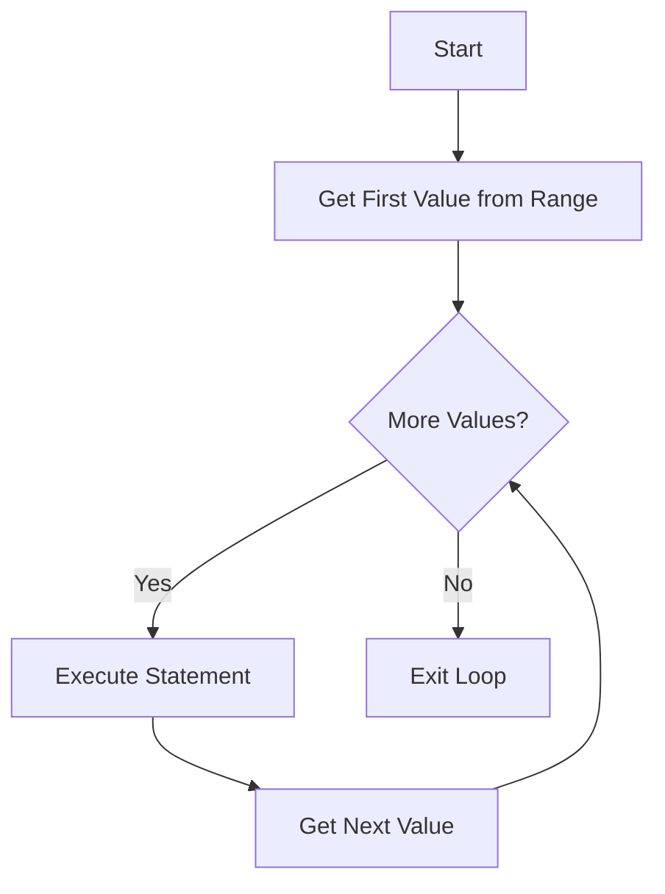
```mermaid
flowchart TD
    A[Start] --> B[Get First Value from Range]
    B --> C{More Values?}
    C -->|Yes| D[Execute Statement]
    D --> E[Get Next Value]
    E --> C
    C -->|No| F[Exit Loop]
```

#### Example 6: Print Numbers 1 to 10

```python
for num in range(1, 11, 1):
    print(num)
```

**Explanation:**
- `range(1, 11, 1)` generates: 1, 2, 3, 4, 5, 6, 7, 8, 9, 10
- Note: 11 is **excluded**
- Each iteration assigns the next value to `num`

---

#### Example 7: Sum of Numbers 1 to 10

```python
sum_value = 0
for num in range(1, 11, 1):
    sum_value = sum_value + num
print(sum_value)
```

**Output:** `55`

**Step-by-Step Calculation:**

| Step | num | Previous Sum | New Sum (sum + num) |
|------|-----|--------------|---------------------|
| 1 | 1 | 0 | 0 + 1 = 1 |
| 2 | 2 | 1 | 1 + 2 = 3 |
| 3 | 3 | 3 | 3 + 3 = 6 |
| 4 | 4 | 6 | 6 + 4 = 10 |
| 5 | 5 | 10 | 10 + 5 = 15 |
| 6 | 6 | 15 | 15 + 6 = 21 |
| 7 | 7 | 21 | 21 + 7 = 28 |
| 8 | 8 | 28 | 28 + 8 = 36 |
| 9 | 9 | 36 | 36 + 9 = 45 |
| 10 | 10 | 45 | 45 + 10 = **55** |

**Mathematical Formula:** Sum = n(n+1)/2 = 10(11)/2 = 55 ✓

---

## 4. Break and Continue

Special statements to control loop execution flow.

### Comparison Table

| Statement | Purpose | Effect |
|-----------|---------|--------|
| **break** | Terminate the loop | Exits loop completely |
| **continue** | Skip current iteration | Moves to next iteration |

### 4.1 Break Statement

**Purpose:** Terminate the loop immediately when a condition is met.

#### Flow Diagram

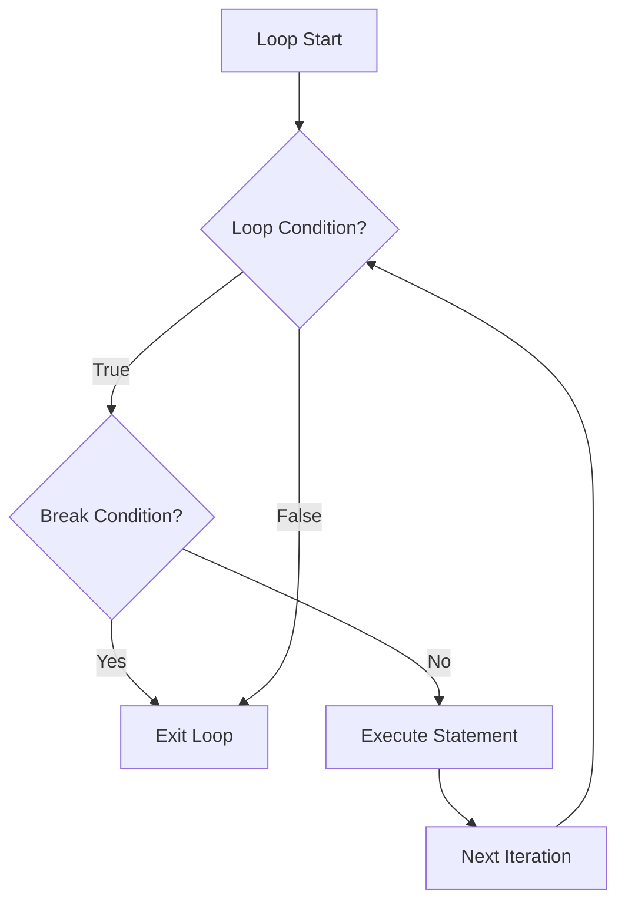
```mermaid
flowchart TD
    A[Loop Start] --> B{Loop Condition?}
    B -->|True| C{Break Condition?}
    C -->|Yes| D[Exit Loop]
    C -->|No| E[Execute Statement]
    E --> F[Next Iteration]
    F --> B
    B -->|False| D
```

#### Example 8: Break When Divisible by 6

```python
for num in range(1, 11):
    if num % 6 == 0:
        break
    print(num)
```

**Output:** `1 2 3 4 5`

**Execution Flow:**

| Iteration | num | Divisible by 6? | Action |
|-----------|-----|-----------------|--------|
| 1 | 1 | No | Print 1 |
| 2 | 2 | No | Print 2 |
| 3 | 3 | No | Print 3 |
| 4 | 4 | No | Print 4 |
| 5 | 5 | No | Print 5 |
| 6 | 6 | **Yes** | **Break (Exit Loop)** |
| 7-10 | - | - | Not executed |

---

### 4.2 Continue Statement

**Purpose:** Skip the current iteration and move to the next one.

#### Flow Diagram

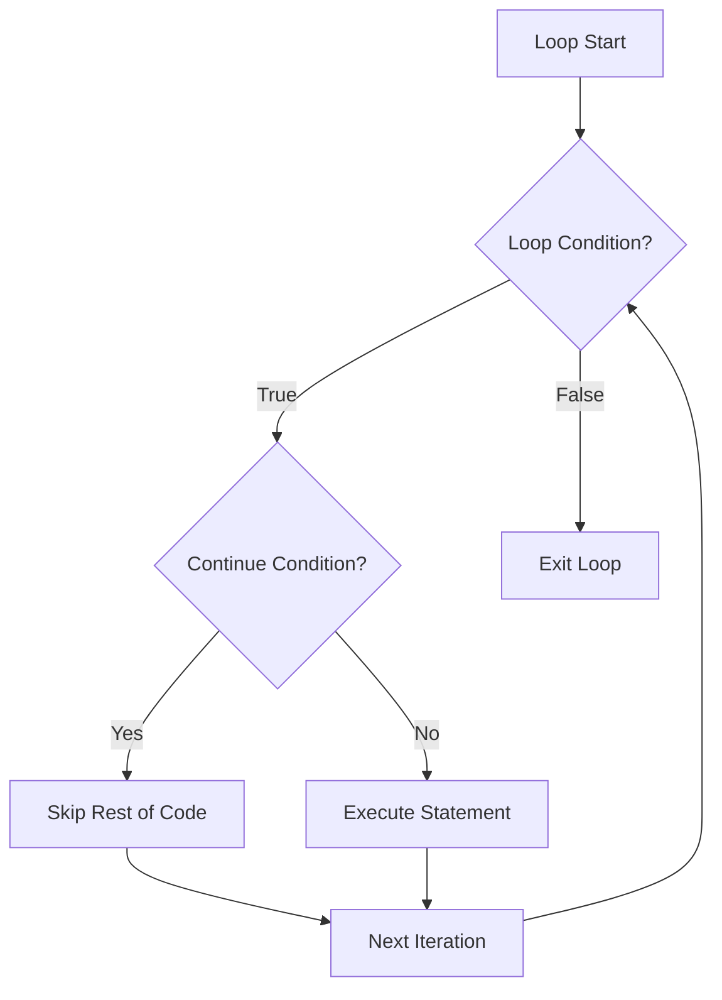
```mermaid
flowchart TD
    A[Loop Start] --> B{Loop Condition?}
    B -->|True| C{Continue Condition?}
    C -->|Yes| D[Skip Rest of Code]
    D --> E[Next Iteration]
    C -->|No| F[Execute Statement]
    F --> E
    E --> B
    B -->|False| G[Exit Loop]
```

#### Example 9: Skip Number 6

```python
for num in range(1, 11):
    if num % 6 == 0:
        continue
    print(num)
```

**Output:** `1 2 3 4 5 7 8 9 10`

**Execution Flow:**

| Iteration | num | Divisible by 6? | Action |
|-----------|-----|-----------------|--------|
| 1 | 1 | No | Print 1 |
| 2 | 2 | No | Print 2 |
| 3 | 3 | No | Print 3 |
| 4 | 4 | No | Print 4 |
| 5 | 5 | No | Print 5 |
| 6 | 6 | **Yes** | **Skip Print** |
| 7 | 7 | No | Print 7 |
| 8 | 8 | No | Print 8 |
| 9 | 9 | No | Print 9 |
| 10 | 10 | No | Print 10 |

---

## 5. Functions

**Functions** are reusable blocks of code that perform specific tasks.

### Why Use Functions?

| Scenario | Without Function | With Function |
|----------|-----------------|---------------|
| Check prime once | Write code directly | Define function, call once |
| Check prime 100 times | Repeat code 100 times | Call function 100 times |

### Key Characteristics

- **Defined once**, used multiple times
- Only executes when **called/invoked**
- Can take **parameters** (inputs)
- Can **return** values (outputs)
- Makes code **modular and reusable**

---

### 5.1 Function Syntax

```python
def function_name(parameters):
    # Function body
    statement(s)
    return value
```

#### Components

| Component | Description | Required? |
|-----------|-------------|-----------|
| `def` | Keyword to define function | Yes |
| `function_name` | Name of the function | Yes |
| `parameters` | Input variables | No |
| `return` | Output value | No |

---

### 5.2 Function Flow Diagram

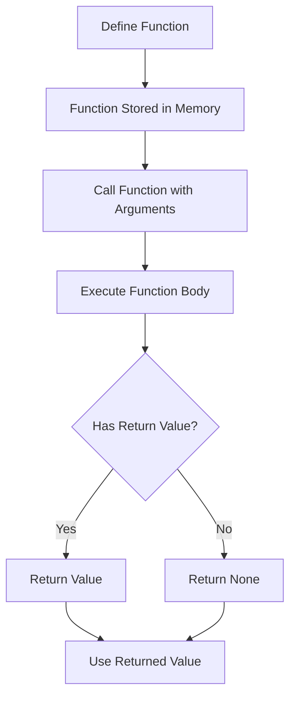
```mermaid
flowchart TD
    A[Define Function] --> B[Function Stored in Memory]
    B --> C[Call Function with Arguments]
    C --> D[Execute Function Body]
    D --> E{Has Return Value?}
    E -->|Yes| F[Return Value]
    E -->|No| G[Return None]
    F --> H[Use Returned Value]
    G --> H
```

### 5.3 Function Examples

#### Example 10: Add Two Numbers

```python
def get_sum(a, b):
    sum_value = a + b
    return sum_value

# Calling the function
result = get_sum(20, 30)
print(result)  # Output: 50
```

**Components Breakdown:**

| Part | Role | Value in Example |
|------|------|------------------|
| `a, b` | **Parameters** (in definition) | Placeholders |
| `20, 30` | **Arguments** (in call) | Actual values |
| `sum_value` | Local variable | Computed inside |
| `return sum_value` | Return statement | Sends back 50 |

---

### 5.4 Parameters vs Arguments

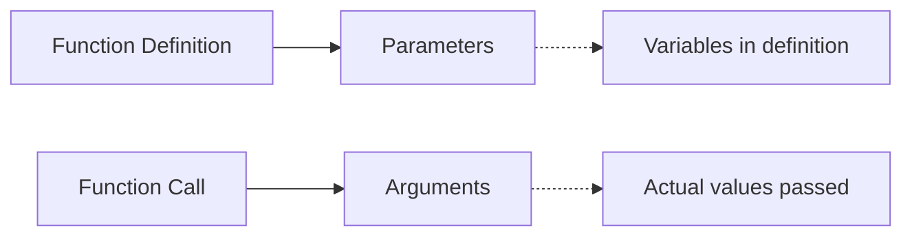
```mermaid
flowchart LR
    A[Function Definition] --> B[Parameters]
    C[Function Call] --> D[Arguments]
    B -.-> E[Variables in definition]
    D -.-> F[Actual values passed]
```

| Term | Location | Example |
|------|----------|---------|
| **Parameters** | Function definition | `def get_sum(a, b):` |
| **Arguments** | Function call | `get_sum(20, 30)` |

**Key Difference:**
- **Parameters** are variables used in function definition
- **Arguments** are actual values passed when calling the function

### 5.5 Important Notes

1. **Function must be called to execute:**
   ```python
   def greet():
       print("Hello")
   
   # This does nothing (function not called)
   
   greet()  # Now it executes
   ```

2. **Print return value:**
   ```python
   def add(a, b):
       return a + b
   
   add(5, 3)        # Returns 8 but doesn't show
   print(add(5, 3)) # Shows: 8
   ```

## 6. Lambda Functions

**Lambda functions** are small, anonymous (unnamed) functions defined in a single line.

### Characteristics

| Feature | Lambda Function | Regular Function |
|---------|----------------|------------------|
| **Name** | Anonymous (no name) | Has a name |
| **Keyword** | `lambda` | `def` |
| **Expressions** | Single expression only | Multiple statements |
| **Arguments** | Any number | Any number |
| **Syntax** | One line | Multiple lines |
| **Return** | Implicit | Explicit `return` |

### 6.1 Lambda Syntax

```python
lambda arguments: expression
```

#### Structure Diagram

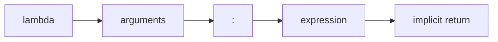
```mermaid
flowchart LR
    A[lambda] --> B[arguments]
    B --> C[:]
    C --> D[expression]
    D --> E[implicit return]
```

### 6.2 Lambda Examples

#### Example 11: Find Maximum of Two Numbers

**Using Lambda:**
```python
max_of = lambda a, b: a if a > b else b

print(max_of(1, 2))  # Output: 2
print(max_of(10, 5)) # Output: 10
```

**Equivalent Regular Function:**
```python
def max_of(a, b):
    if a > b:
        return a
    else:
        return b
```

**Comparison:**

| Aspect | Lambda | Regular Function |
|--------|--------|------------------|
| Lines of code | 1 | 4 |
| Readability | Good for simple | Better for complex |
| Reusability | Limited | High |

### 6.3 How Lambda Works

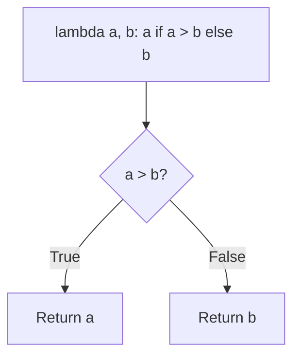
```mermaid
flowchart TD
    A[lambda a, b: a if a > b else b] --> B{a > b?}
    B -->|True| C[Return a]
    B -->|False| D[Return b]
```

**Expression Breakdown:**
```python
a if a > b else b
```
- If `a > b` is True → return `a`
- Otherwise → return `b`

### 6.4 When to Use Lambda

✅ **Good Use Cases:**
- Simple operations
- One-time use
- Sorting with key functions
- Map, filter, reduce operations

❌ **Avoid Lambda When:**
- Complex logic needed
- Multiple statements required
- Need to reuse multiple times
- Debugging is important

## 7. Variable Scope

**Scope** determines where a variable can be accessed in your code.

### 7.1 Scope Definition

> "A variable is only available from inside the region it is created."

### Types of Scope

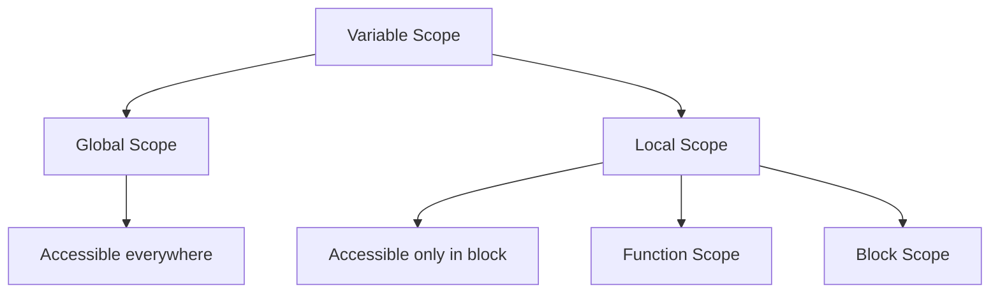
```mermaid
flowchart TD
    A[Variable Scope] --> B[Global Scope]
    A --> C[Local Scope]
    B --> D[Accessible everywhere]
    C --> E[Accessible only in block]
    C --> F[Function Scope]
    C --> G[Block Scope]
```


### 7.2 Scope Rules

| Scope Type | Access Level | Example |
|------------|--------------|---------|
| **Global** | Entire program | Variable defined outside functions |
| **Local (Function)** | Inside function only | Variable defined inside function |
| **Local (Block)** | Inside block only | Variable in if/for blocks |

---

### 7.3 Scope Examples

#### Example 12: Global Variable Accessible in Function

```python
v1 = 20

def fun1():
    print(v1)  # Can access global variable

fun1()  # Output: 20
```

**Diagram:**

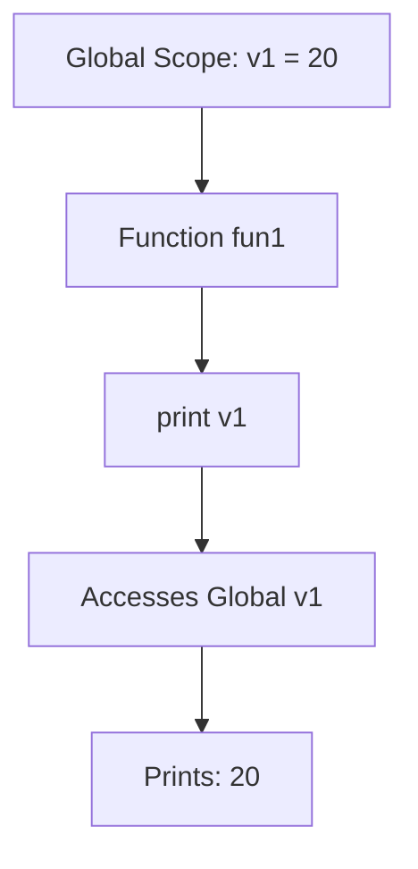
```mermaid
flowchart TD
    A[Global Scope: v1 = 20] --> B[Function fun1]
    B --> C[print v1]
    C --> D[Accesses Global v1]
    D --> E[Prints: 20]
```

---

#### Example 13: Local Variable Not Accessible Outside

```python
def fun1():
    v2 = 30
    print(v2)  # Works: 30

fun1()         # Works: 30
print(v2)      # Error: NameError: name 'v2' is not defined
```

**Why?** `v2` exists only inside `fun1()` scope.

**Scope Visualization:**

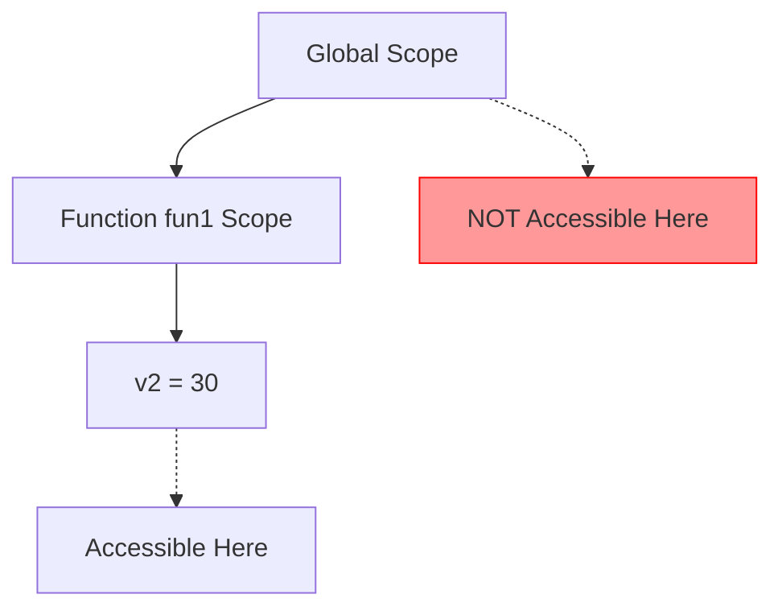
```mermaid
flowchart TD
    A[Global Scope] --> B[Function fun1 Scope]
    B --> C[v2 = 30]
    C -.-> D[Accessible Here]
    A -.-> E[NOT Accessible Here]
    style E fill:#f99,stroke:#f00
```

---

#### Example 14: Nested Scope Access

```python
def fun1():
    v2 = 30
    
    if v1 > 10:  # v1 from global
        print(v2)  # v2 from function scope

v1 = 20
fun1()  # Output: 30
```

**Scope Hierarchy:**

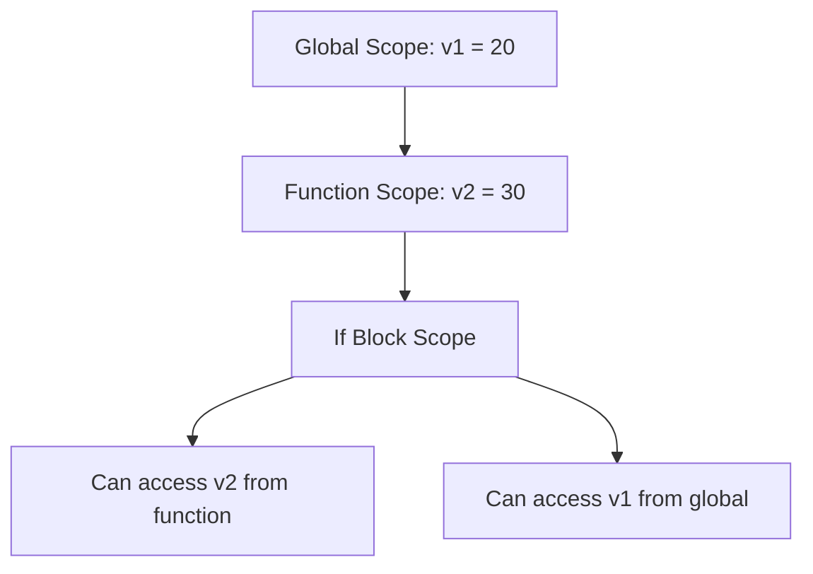
```mermaid
flowchart TD
    A[Global Scope: v1 = 20] --> B[Function Scope: v2 = 30]
    B --> C[If Block Scope]
    C --> D[Can access v2 from function]
    C --> E[Can access v1 from global]
```

**Rule:** Inner blocks can access outer scope variables.

---

#### Example 15: Variable Shadowing

```python
a = 20  # Global

def fun1():
    a = 35  # Local (shadows global)
    print("a inside fun:", a)

fun1()  # Output: a inside fun: 35
print("a outside fun:", a)  # Output: a outside fun: 20
```

**Important:** Local `a` **shadows** global `a` inside function.

**Scope Diagram:**

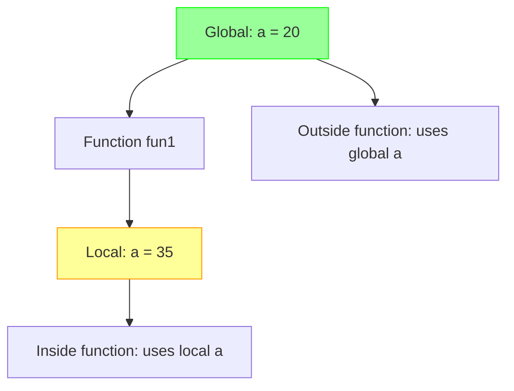
```mermaid
flowchart TD
    A[Global: a = 20] --> B[Function fun1]
    B --> C[Local: a = 35]
    C --> D[Inside function: uses local a]
    A --> E[Outside function: uses global a]
    
    style C fill:#ff9,stroke:#f90
    style A fill:#9f9,stroke:#0f0
```

**Visualization:**

| Location | Variable | Value |
|----------|----------|-------|
| Global scope | `a` | 20 |
| Inside `fun1()` | `a` (local) | 35 |
| After `fun1()` returns | `a` | 20 (unchanged) |

---

#### Example 16: No Local Variable - Uses Global

```python
a = 20  # Global

def fun1():
    # No local 'a' defined
    print("a inside fun:", a)  # Uses global

fun1()  # Output: a inside fun: 20
```

**Variable Lookup Process:**

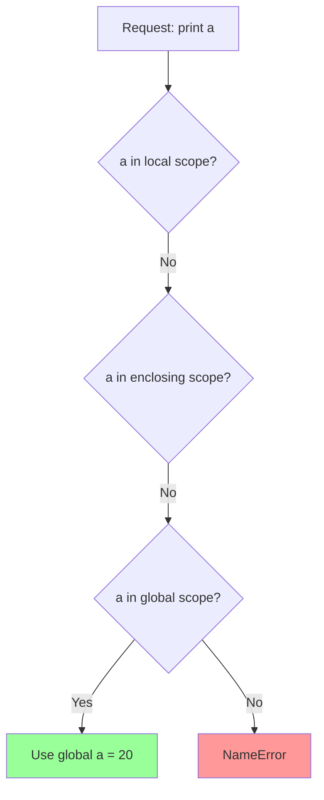
```mermaid
flowchart TD
    A[Request: print a] --> B{a in local scope?}
    B -->|No| C{a in enclosing scope?}
    C -->|No| D{a in global scope?}
    D -->|Yes| E[Use global a = 20]
    D -->|No| F[NameError]
    
    style E fill:#9f9
    style F fill:#f99
```

---

#### Example 17: Parameter Name Same as Global Variable

```python
x = 30  # Global

def function1(x):  # Parameter name same as global
    print("x inside fun:", x)

function1(10)  # Output: x inside fun: 10
print("x outside fun:", x)  # Output: x outside fun: 30
```

**Explanation:**

| Context | Which `x` is used? | Value |
|---------|-------------------|-------|
| Inside `function1()` | Parameter `x` | 10 (argument passed) |
| Outside function | Global `x` | 30 |

**Key Point:** When function is called, the parameter `x` **shadows** global `x` inside the function.

**Scope Visualization:**

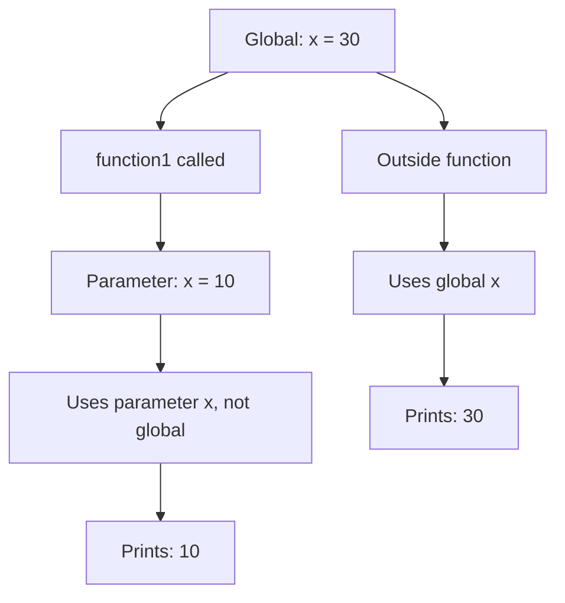
```mermaid
flowchart TD
    A[Global: x = 30] --> B[function1 called]
    B --> C[Parameter: x = 10]
    C --> D[Uses parameter x, not global]
    D --> E[Prints: 10]
    A --> F[Outside function]
    F --> G[Uses global x]
    G --> H[Prints: 30]
```

### 7.4 Scope Resolution Rules (LEGB)

Python searches for variables in this order:

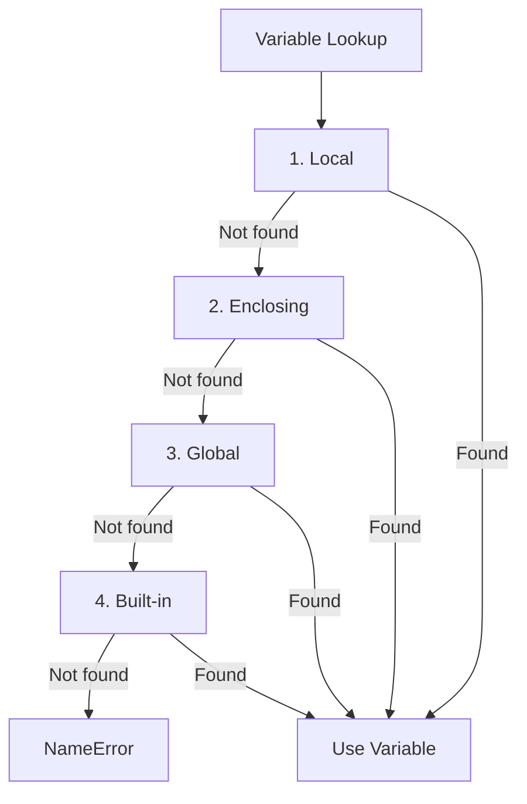
```mermaid
flowchart TD
    A[Variable Lookup] --> B[1. Local]
    B -->|Not found| C[2. Enclosing]
    C -->|Not found| D[3. Global]
    D -->|Not found| E[4. Built-in]
    E -->|Not found| F[NameError]
    
    B -->|Found| G[Use Variable]
    C -->|Found| G
    D -->|Found| G
    E -->|Found| G
```

| Order | Scope | Description |
|-------|-------|-------------|
| **L** | Local | Current function |
| **E** | Enclosing | Parent function (if nested) |
| **G** | Global | Module level |
| **B** | Built-in | Python built-in names |


### 7.5 Scope Best Practices

✅ **Do:**
- Use meaningful variable names
- Minimize global variables
- Keep functions self-contained
- Pass data via parameters

❌ **Don't:**
- Use same names for global and local variables unnecessarily
- Rely on global variables inside functions
- Modify global state without reason

## Summary Tables

### Flow Control Summary

| Control Type | Keyword | Purpose | Repetition |
|--------------|---------|---------|------------|
| Conditional | `if`, `elif`, `else` | Decision making | Once |
| While Loop | `while` | Condition-based repetition | Until False |
| For Loop | `for` | Sequence-based repetition | Fixed iterations |
| Break | `break` | Exit loop early | - |
| Continue | `continue` | Skip iteration | - |

### Function Types Summary

| Type | Syntax | Name | Use Case |
|------|--------|------|----------|
| Regular | `def name(params):` | Named | Complex, reusable code |
| Lambda | `lambda params: expr` | Anonymous | Simple, one-time operations |

### Scope Summary

| Scope | Defined | Accessible | Example |
|-------|---------|------------|---------|
| Global | Outside functions | Everywhere | `x = 10` (at module level) |
| Local (Function) | Inside function | Function only | `def f(): x = 10` |
| Local (Block) | Inside if/for/while | Block only | `if True: x = 10` |


## Key Takeaways

1. **Conditional Statements** allow code to make decisions
2. **Loops** eliminate repetitive code writing
3. **For loops** are cleaner than while loops for known iterations
4. **Break** exits loops; **Continue** skips iterations
5. **Functions** make code modular and reusable
6. **Lambda functions** are concise for simple operations
7. **Scope** determines variable accessibility
8. **Inner scopes** can access outer scope variables
9. **Local variables shadow global** variables with same names
10. **Parameters shadow global** variables inside functions


## Practice Exercises

### Exercise 1: Conditional
Write a program to check if a year is a leap year.

### Exercise 2: While Loop
Print even numbers from 2 to 20 using while loop.

### Exercise 3: For Loop
Calculate factorial of a number using for loop.

### Exercise 4: Break
Print numbers 1 to 100 but stop when divisible by 7.

### Exercise 5: Continue
Print numbers 1 to 20 but skip multiples of 3.

### Exercise 6: Function
Create a function to check if a number is prime.

### Exercise 7: Lambda
Create lambda function to calculate square of a number.

### Exercise 8: Scope
Predict the output of code with global and local variables.


## Glossary

| Term | Definition |
|------|------------|
| **Condition** | Expression that evaluates to True or False |
| **Iteration** | One execution of loop body |
| **Parameter** | Variable in function definition |
| **Argument** | Value passed to function |
| **Scope** | Region where variable is accessible |
| **Shadowing** | Local variable hides global variable |
| **Anonymous Function** | Function without a name (lambda) |
| **Block** | Group of statements with same indentation |
| **Indentation** | Spaces/tabs defining code blocks in Python |


**End of Notes**
