# Python Classes and Objects - Comprehensive Notes

## Table of Contents
1. [Introduction to Data Types](#introduction-to-data-types)
2. [Understanding Classes and Objects](#understanding-classes-and-objects)
3. [Constructors in Python](#constructors-in-python)
4. [The Self Parameter](#the-self-parameter)
5. [Attributes in Python](#attributes-in-python)
6. [Methods in Python](#methods-in-python)
7. [Real-World Example: Bank Account System](#real-world-example-bank-account-system)

---

## 1. Introduction to Data Types

### 1.1 Predefined Data Types

**Predefined data types** are built-in data types that already exist in Python.

| Data Type | Category | Example | Description |
|-----------|----------|---------|-------------|
| **int** | Numeric | `42` | Integer numbers |
| **float** | Numeric | `3.14` | Decimal numbers |
| **str** | Text | `"Hello"` | String/Text |
| **list** | Collection | `[1, 2, 3]` | Ordered, mutable |
| **tuple** | Collection | `(1, 2, 3)` | Ordered, immutable |
| **dict** | Collection | `{"key": "value"}` | Key-value pairs |
| **set** | Collection | `{1, 2, 3}` | Unordered, unique |

---

### 1.2 Need for User-Defined Data Types

#### Problem Scenarios

Predefined data types are **insufficient** for complex real-world problems:

| Scenario | Required Data | Why Predefined Types Fail |
|----------|---------------|---------------------------|
| **3D Modeling Project** | 3D Vector with X, Y, Z coordinates + operations (dot product, cross product, magnitude) | No single type represents a vector with operations |
| **Library Management** | Book with title, author, year, ISBN | Need custom structure for book entity |
| **User Management** | User with name, phone, email, address | Need to group related user information |

**Solution:** Create **user-defined data types** using **Classes**

---

### 1.3 Introduction to Classes

> **Class**: A template or blueprint for creating real-world entities with custom data types

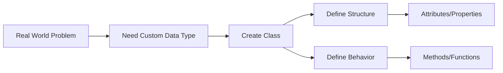

---

## 2. Understanding Classes and Objects

### 2.1 The Bank Form Analogy

Understanding classes through a real-world analogy:

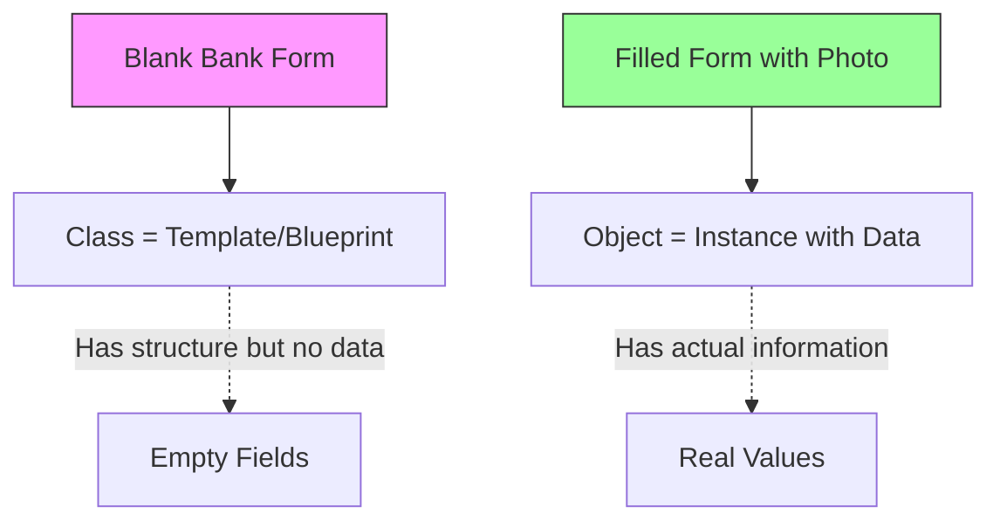

#### Analogy Breakdown

| Bank Form | Programming Concept |
|-----------|---------------------|
| **Blank Form** | **Class** (Template) |
| Empty fields (Name, Address, etc.) | Attributes (Variables) |
| Instructions on form | Methods (Functions) |
| **Filled Form** | **Object** (Instance) |
| Your actual name, address | Actual data values |
| Your attached photo | Specific object data |

**Key Insight:** 
- **Class** = Blank form (just structure, no meaning alone)
- **Object** = Filled form (has real data, makes sense)

---

### 2.2 Class vs Object

#### Visual Comparison

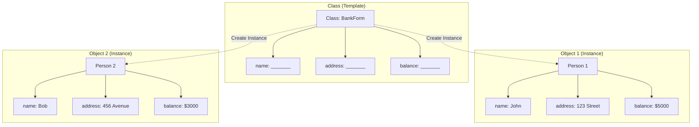

#### Comparison Table

| Aspect | Class | Object |
|--------|-------|--------|
| **Definition** | Template/Blueprint | Instance of a class |
| **Memory** | No memory allocated | Memory allocated |
| **Data** | No actual data | Contains actual data |
| **Purpose** | Define structure | Represent real entity |
| **Creation** | Defined using `class` keyword | Created by calling class |
| **Example** | Recipe | Actual cooked dish |

---

### 2.3 Everything is an Object in Python

```python
num = 20
print(type(num))
```

**Output:** `<class 'int'>`

**Key Discovery:** Even predefined types like `int` are classes!

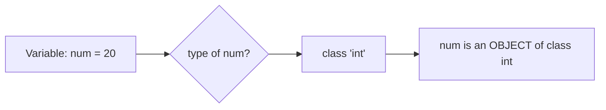

> **Principle:** Almost everything in Python is an object with properties and methods.

---

### 2.4 Creating Your First Class

#### Basic Syntax

```python
class MyClass:
    name = "John"
```

| Component | Purpose |
|-----------|---------|
| `class` | Keyword to define a class |
| `MyClass` | Class name (starts with **capital letter**) |
| `name = "John"` | Class attribute |

#### Creating Objects

```python
# Create object (instance)
person1 = MyClass()
person2 = MyClass()

# Print class and objects
print(MyClass)   # <class '__main__.MyClass'>
print(person1)   # <__main__.MyClass object at 0x...>
print(person2)   # <__main__.MyClass object at 0x...>
```

**Memory Allocation Analysis:**

| Item | Memory Allocated? | Memory Address |
|------|-------------------|----------------|
| `MyClass` (class) | ❌ No | N/A |
| `person1` (object) | ✅ Yes | `0x7f8b3c4d5e60` (example) |
| `person2` (object) | ✅ Yes | `0x7f8b3c4d5e90` (different) |

**Key Points:**
1. Class = No memory allocation
2. Each object = Unique memory location
3. Multiple objects from one class = Different memory addresses

---

### 2.5 Class and Object Relationship Diagram

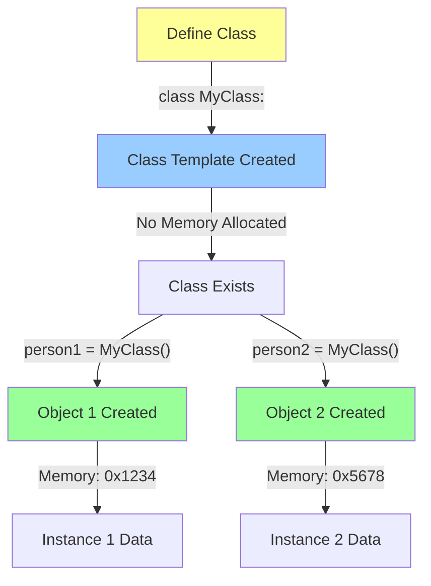

---

## 3. Constructors in Python

### 3.1 What is a Constructor?

> **Constructor**: A special method automatically called when an object is created.

#### Constructor Characteristics

| Feature | Description |
|---------|-------------|
| **Name** | `__init__` (double underscore on both sides) |
| **Type** | Special method |
| **Call** | Automatic (when object created) |
| **Purpose** | Initialize object attributes |
| **Mandatory** | No (Python creates default if not defined) |

---

### 3.2 Constructor Flow

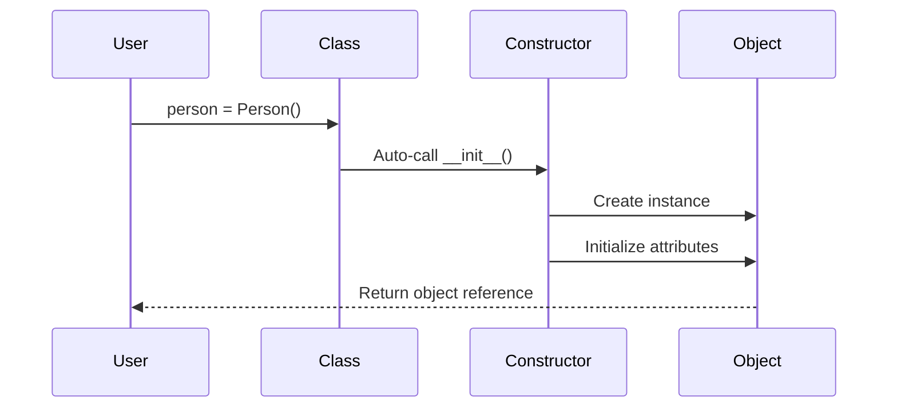

---

### 3.3 Types of Constructors

#### Comparison Table

| Type | Parameters | Values | Use Case |
|------|------------|--------|----------|
| **Default Constructor** | Only `self` | Hardcoded/Fixed | Same values for all objects |
| **Parameterized Constructor** | `self` + arguments | From user input | Different values per object |

---

### 3.4 Default Constructor

A constructor that **doesn't accept arguments** (except `self`).

#### Example: Default Constructor

```python
class Person:
    def __init__(self):
        self.name = "John"

# Create objects
person1 = Person()
person2 = Person()

print(person1.name)  # Output: John
print(person2.name)  # Output: John
```

**Problem:** All objects have the **same values**

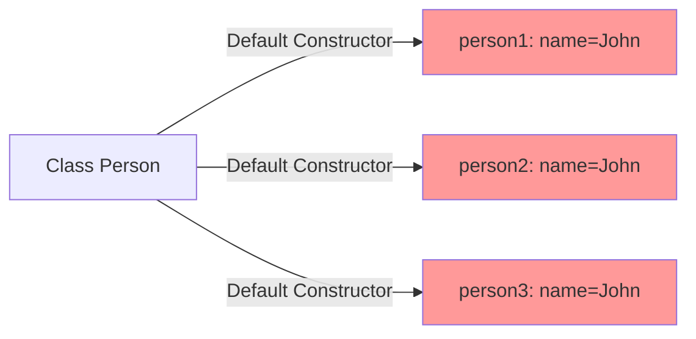

---

### 3.5 Parameterized Constructor

A constructor that **accepts arguments** to customize each object.

#### Example: Parameterized Constructor

```python
class Person:
    def __init__(self, name_from_user):
        self.name = name_from_user

# Create objects with different names
person1 = Person("John")
person2 = Person("Bob")
person3 = Person("Rick")

print(person1.name)  # Output: John
print(person2.name)  # Output: Bob
print(person3.name)  # Output: Rick
```

**Advantage:** Each object has **unique values**

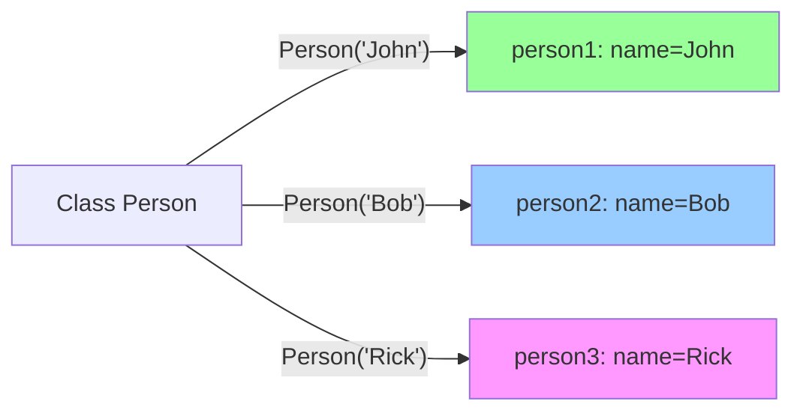

---

### 3.6 Constructor Comparison Example

#### Code Comparison

| Default Constructor | Parameterized Constructor |
|---------------------|---------------------------|
| `def __init__(self):` | `def __init__(self, name):` |
| `self.name = "John"` | `self.name = name` |
| `person1 = Person()` | `person1 = Person("John")` |
| All objects → Same data | Each object → Unique data |

---

## 4. The Self Parameter

### 4.1 Understanding Self

> **self**: A reference to the current instance of the class.

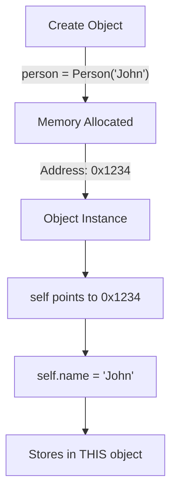

---

### 4.2 Why Do We Need Self?

#### Problem Without Self

**Question:** How does Python know **which object** to store data in?

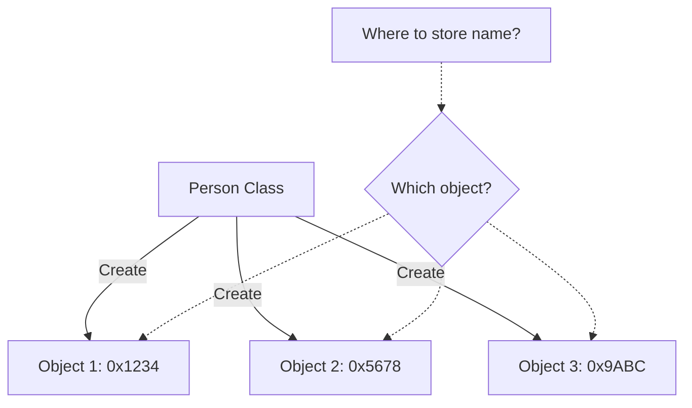

**Solution:** Use `self` to identify the target object!

---

### 4.3 How Self Works - Step by Step

#### Visual Explanation

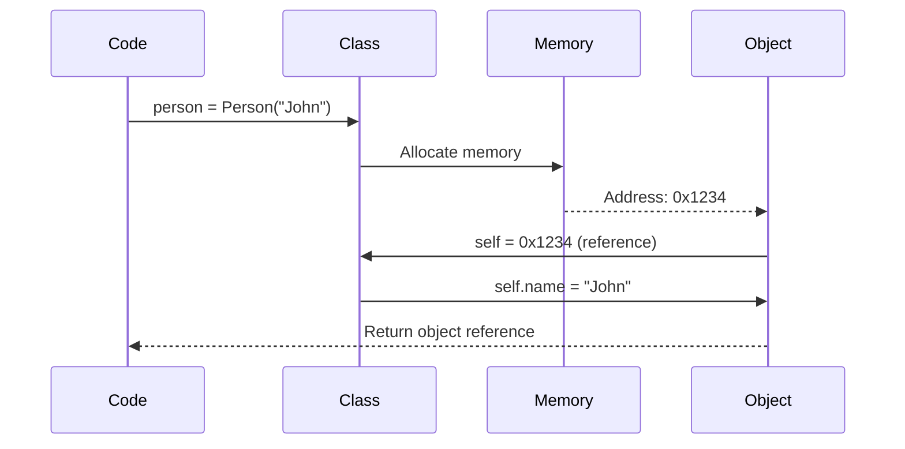

#### Step-by-Step Table

| Step | Action | Description |
|------|--------|-------------|
| 1 | `person = Person("John")` | Call class to create object |
| 2 | Constructor `__init__` called | Automatic invocation |
| 3 | Memory allocated | OS assigns address (e.g., 0x1234) |
| 4 | `self` = instance reference | `self` points to 0x1234 |
| 5 | `self.name = "John"` | Store "John" at 0x1234.name |
| 6 | Return object | Variable `person` holds reference |

---

### 4.4 Self in Detail

```python
class Person:
    def __init__(self, name_from_user):
        # self refers to the NEW object being created
        self.name = name_from_user
        # Breakdown: self (this object) . name (attribute) = value

# Create object
person1 = Person("John")
# During creation:
# 1. Memory allocated → 0x1234
# 2. self = reference to 0x1234
# 3. self.name = "John" → Store at 0x1234
```

#### Self Reference Diagram

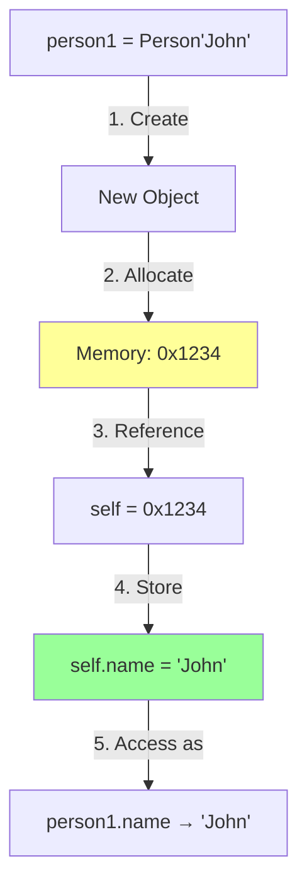

---

### 4.5 Self Rules

| Rule | Explanation |
|------|-------------|
| **First parameter** | Always the first parameter in any method |
| **Auto-passed** | Python automatically passes the instance |
| **Naming convention** | Must be named `self` (convention, not keyword) |
| **Instance reference** | Points to the object calling the method |
| **Accessing attributes** | Use `self.attribute_name` |

---

## 5. Attributes in Python

### 5.1 What are Attributes?

> **Attributes**: Variables that belong to a class and store data.

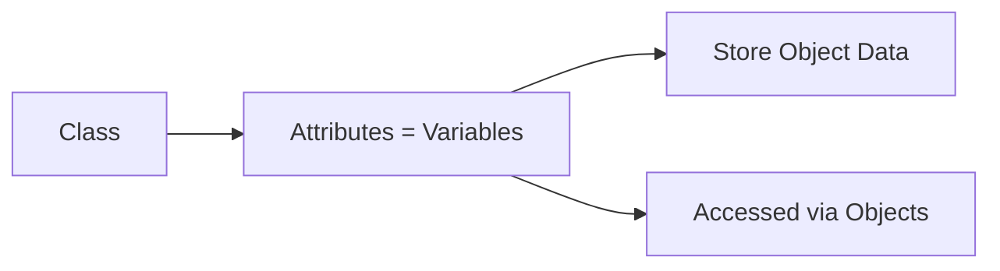

**Key Point:** Attributes defined inside a class **cannot be accessed directly** from outside. They must be accessed through objects.

---

### 5.2 Types of Attributes

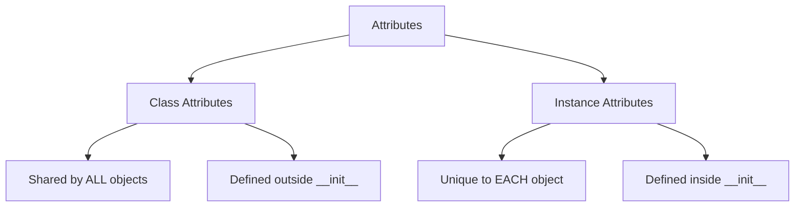

---

### 5.3 Class Attributes

**Class Attributes** are shared by **all instances** of the class.

#### Example: Student Class

```python
class Student:
    # Class attribute (shared by all)
    school_name = "ABC School"
    
    def __init__(self, name, roll_number):
        # Instance attributes (unique per object)
        self.name = name
        self.roll_number = roll_number

# Create objects
student1 = Student("John", 45)
student2 = Student("Bob", 46)
student3 = Student("Robert", 47)

# Access class attribute
print(student1.school_name)  # ABC School
print(student2.school_name)  # ABC School
print(student3.school_name)  # ABC School

# Access instance attributes
print(student1.name)          # John
print(student2.name)          # Bob
print(student3.name)          # Robert
```

---

#### Class Attribute Visualization

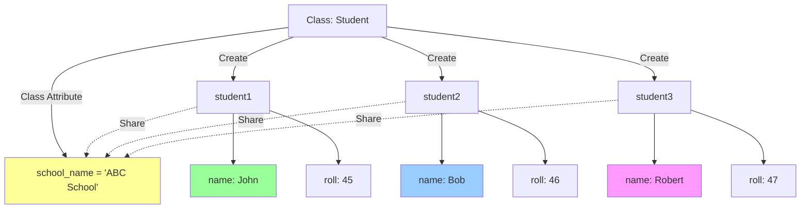

---

### 5.4 Instance Attributes

**Instance Attributes** are unique to **each object**.

#### Comparison Table

| Attribute Type | Defined Where | Scope | Uniqueness | Example |
|----------------|---------------|-------|------------|---------|
| **Class Attribute** | Outside `__init__` | All instances | Same for all | `school_name` |
| **Instance Attribute** | Inside `__init__` | Single instance | Unique per object | `name`, `roll_number` |

---

### 5.5 Accessing Attributes

```python
class Student:
    school_name = "ABC School"  # Class attribute
    
    def __init__(self, name, roll_number):
        self.name = name          # Instance attribute
        self.roll_number = roll_number

student1 = Student("John", 45)

# Access attributes using dot notation
print(student1.school_name)    # Class attribute
print(student1.name)           # Instance attribute
print(student1.roll_number)    # Instance attribute
```

**Access Syntax:** `object_name.attribute_name`

---

### 5.6 Attribute Access Rules

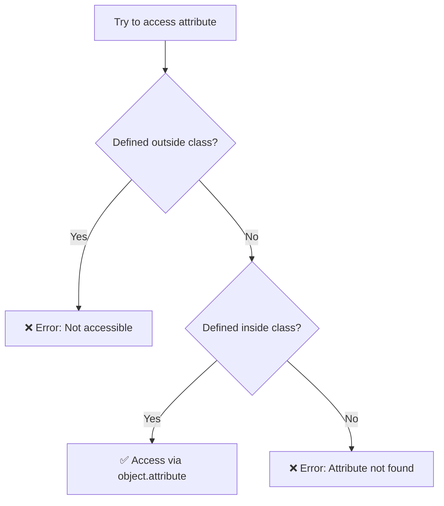

#### Example: Attribute Scope

```python
class Person:
    def __init__(self, name):
        self.name = name

person1 = Person("John")

# ✅ Correct: Access via object
print(person1.name)  # Works: John

# ❌ Wrong: Direct access
print(name)  # Error: NameError: name 'name' is not defined
```

---

## 6. Methods in Python

### 6.1 What are Methods?

> **Methods**: Functions defined inside a class and associated with objects.

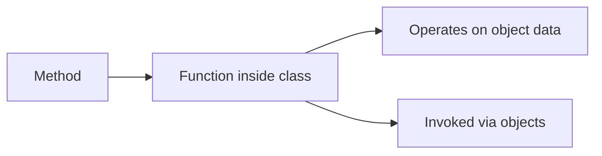

---

### 6.2 Method Characteristics

| Feature | Description |
|---------|-------------|
| **Definition** | Defined inside class using `def` |
| **First parameter** | Always `self` |
| **Access** | Called via objects using dot notation |
| **Purpose** | Perform operations on object data |
| **Can access** | All attributes of the class via `self` |

---

### 6.3 Method vs Function

| Aspect | Function | Method |
|--------|----------|--------|
| **Location** | Outside class | Inside class |
| **First parameter** | Any or none | Must be `self` |
| **Call** | Direct: `function_name()` | Via object: `obj.method()` |
| **Access to data** | Only passed parameters | All class attributes via `self` |

---

### 6.4 Creating Methods

#### Example: Person Class with Method

```python
class Person:
    def __init__(self, name):
        self.name = name
    
    # Method definition
    def introduce(self):
        print(f"Hello, I am {self.name}")

# Create object
person1 = Person("Jack")

# Access attribute (no parentheses)
print(person1.name)      # Jack

# Call method (with parentheses)
person1.introduce()      # Hello, I am Jack
```

---

### 6.5 Method Invocation Flow

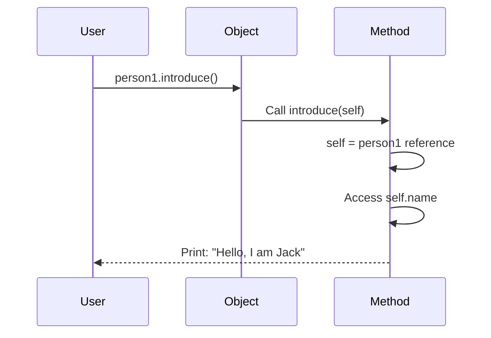

---

### 6.6 Key Differences: Attribute vs Method

```python
class Person:
    def __init__(self, name):
        self.name = name  # Attribute
    
    def introduce(self):   # Method
        print(f"Hello, I am {self.name}")

person1 = Person("Jack")

# Attribute access: NO parentheses
print(person1.name)        # ✅ Correct

# Method call: WITH parentheses
person1.introduce()        # ✅ Correct

# Common mistakes:
print(person1.name())      # ❌ Error: str is not callable
person1.introduce          # ❌ Doesn't execute (just reference)
```

#### Syntax Comparison

| Access Type | Syntax | Needs `()` ? | Example |
|-------------|--------|--------------|---------|
| **Attribute** | `object.attribute` | ❌ No | `person1.name` |
| **Method** | `object.method()` | ✅ Yes | `person1.introduce()` |

---

## 7. Real-World Example: Bank Account System

### 7.1 Requirements Analysis

#### System Requirements

| Feature | Description | Implementation |
|---------|-------------|----------------|
| **Bank Name** | Same for all accounts | Class attribute |
| **Account Holder** | Name, Age, ID, Mobile | Instance attributes |
| **Balance** | Current account balance | Instance attribute |
| **Check Balance** | View current balance | Method |
| **Deposit** | Add money to account | Method |
| **Withdraw** | Remove money (with validation) | Method |

---

### 7.2 System Design

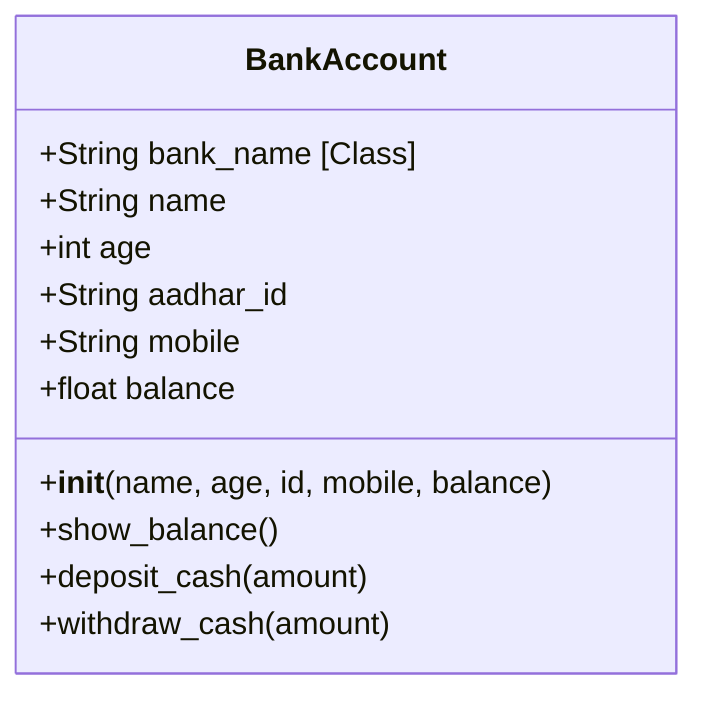

---

### 7.3 Complete Implementation

```python
class BankAccount:
    # Class attribute (same for all accounts)
    bank_name = "ABC Bank"
    
    # Constructor
    def __init__(self, name, age, aadhar_id, mobile, balance):
        # Instance attributes
        self.name = name
        self.age = age
        self.aadhar_id = aadhar_id
        self.mobile_number = mobile
        self.balance = balance
    
    # Method 1: Show balance
    def show_balance(self):
        print(f"{self.name}, your current balance is {self.balance}")
    
    # Method 2: Deposit cash
    def deposit_cash(self, amount):
        self.balance += amount
        print(f"{self.name}, you have deposited {amount}")
        print(f"Your current account balance is {self.balance}")
    
    # Method 3: Withdraw cash
    def withdraw_cash(self, amount):
        if self.balance < amount:
            print(f"{self.name}, insufficient funds!")
            print(f"Your balance is {self.balance}")
        else:
            self.balance -= amount
            print(f"{self.name}, you have withdrawn {amount}")
            print(f"Your current balance is {self.balance}")
```

---

### 7.4 Using the Bank Account System

#### Example Usage

```python
# Create account
account1 = BankAccount(
    name="Bob",
    age=34,
    aadhar_id="999958888",
    mobile="9999999999",
    balance=10000
)

# Check balance
account1.show_balance()
# Output: Bob, your current balance is 10000

# Deposit money
account1.deposit_cash(20000)
# Output: Bob, you have deposited 20000
#         Your current account balance is 30000

# Withdraw money (success)
account1.withdraw_cash(10000)
# Output: Bob, you have withdrawn 10000
#         Your current balance is 20000

# Withdraw money (failure - insufficient funds)
account1.withdraw_cash(50000)
# Output: Bob, insufficient funds!
#         Your balance is 20000
```

---

### 7.5 Operation Flow Diagrams

#### Deposit Flow

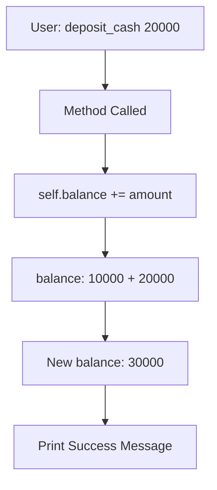

#### Withdraw Flow

```mermaid
flowchart TD
    A[User: withdraw_cash amount] --> B{balance < amount?}
    B -->|Yes| C[Print: Insufficient Funds]
    C --> D[Show Current Balance]
    B -->|No| E[balance -= amount]
    E --> F[Update Balance]
    F --> G[Print Success Message]
```

---

### 7.6 Transaction Examples Table

| Operation | Initial Balance | Amount | Condition Check | New Balance | Message |
|-----------|-----------------|--------|-----------------|-------------|---------|
| Deposit | 10,000 | +20,000 | N/A | 30,000 | Deposited successfully |
| Withdraw | 30,000 | -10,000 | 30,000 ≥ 10,000 ✅ | 20,000 | Withdrawn successfully |
| Withdraw | 20,000 | -50,000 | 20,000 < 50,000 ❌ | 20,000 | Insufficient funds |

---

### 7.7 Key Features of the System

| Feature | Implementation Detail |
|---------|----------------------|
| **Data Encapsulation** | All account data stored in object |
| **Validation** | Withdraw checks sufficient balance |
| **State Management** | Balance updates tracked |
| **User Feedback** | Clear messages for all operations |
| **Reusability** | Multiple accounts from one class |

---

## Summary

### Key Concepts Learned

```mermaid
mindmap
  root((Python OOP))
    Classes
      Template/Blueprint
      No memory allocation
      Defined with 'class' keyword
    Objects
      Instances of classes
      Memory allocated
      Hold actual data
    Constructors
      __init__ method
      Auto-called on creation
      Default vs Parameterized
    Self Parameter
      References current object
      First parameter always
      Enables data storage
    Attributes
      Class attributes shared
      Instance attributes unique
      Access via dot notation
    Methods
      Functions in class
      Operate on object data
      Called with parentheses
```

---

### Comparison Summary Table

| Concept | Definition | Key Feature | Example |
|---------|------------|-------------|---------|
| **Class** | Blueprint/Template | No memory, defines structure | `class Person:` |
| **Object** | Instance of class | Has memory, holds data | `person1 = Person()` |
| **Constructor** | Initialization method | Auto-called on creation | `def __init__(self):` |
| **self** | Object reference | Points to current instance | `self.name = "John"` |
| **Class Attribute** | Shared variable | Same for all objects | `school_name = "ABC"` |
| **Instance Attribute** | Unique variable | Different per object | `self.name = name` |
| **Method** | Class function | Operates on object data | `def show_balance(self):` |

---

### When to Use What

```mermaid
flowchart TD
    A[Need Custom Data Type?] -->|Yes| B[Create Class]
    A -->|No| C[Use Built-in Types]
    
    B --> D[Need Different Values?]
    D -->|Yes| E[Parameterized Constructor]
    D -->|No| F[Default Constructor]
    
    B --> G[Data Same for All?]
    G -->|Yes| H[Class Attribute]
    G -->|No| I[Instance Attribute]
    
    B --> J[Need Operations?]
    J -->|Yes| K[Define Methods]
```

---

### Best Practices

| Practice | Description | Example |
|----------|-------------|---------|
| **Naming** | Class names start with capital | `BankAccount`, not `bankAccount` |
| **Constructor** | Use parameterized for flexibility | `def __init__(self, name):` |
| **self** | Always first parameter | `def method(self):` |
| **Attributes** | Use instance attributes for uniqueness | `self.name = name` |
| **Methods** | Group related operations | Deposit and withdraw in same class |
| **Validation** | Check conditions before operations | Verify balance before withdrawal |

---

### Common Mistakes and Solutions

| Mistake | Problem | Solution |
|---------|---------|----------|
| Forgetting `self` | Can't access attributes | Always include `self` as first parameter |
| No `()` when calling method | Method not executed | Use `object.method()` not `object.method` |
| Using `()` with attribute | TypeError | Use `object.attribute` not `object.attribute()` |
| Wrong class naming | Convention violation | Start with capital: `MyClass` not `myclass` |
| Direct attribute access | NameError | Access via object: `obj.attr` not just `attr` |

---

### Practice Exercises

#### Exercise 1: Student Class
Create a `Student` class with:
- Attributes: name, roll_number, grade
- Methods: display_info(), update_grade()

#### Exercise 2: Car Class
Create a `Car` class with:
- Attributes: brand, model, year, speed
- Methods: accelerate(), brake(), display_speed()

#### Exercise 3: Library System
Create a `Book` class with:
- Attributes: title, author, isbn, available
- Methods: borrow(), return_book(), display_info()

#### Exercise 4: Calculator Class
Create a `Calculator` class with:
- Methods: add(), subtract(), multiply(), divide()
- Include validation for division by zero

#### Exercise 5: Employee Management
Create an `Employee` class with:
- Class attribute: company_name
- Instance attributes: name, id, salary
- Methods: give_raise(), display_details()

---

### Glossary

| Term | Definition |
|------|------------|
| **Class** | Blueprint for creating objects |
| **Object** | Instance of a class with actual data |
| **Instance** | Another term for object |
| **Constructor** | Method that initializes new objects (`__init__`) |
| **self** | Reference to the current instance |
| **Attribute** | Variable that belongs to a class/object |
| **Method** | Function defined inside a class |
| **Class Attribute** | Variable shared by all instances |
| **Instance Attribute** | Variable unique to each instance |
| **Instantiation** | Process of creating an object from a class |
| **Encapsulation** | Bundling data and methods in a class |
| **dot notation** | Syntax for accessing attributes/methods (`obj.attr`) |

---

### Quick Reference Card

```python
# Class Definition
class ClassName:
    class_attribute = value            # Class attribute
    
    def __init__(self, param):         # Constructor
        self.instance_attribute = param # Instance attribute
    
    def method_name(self):             # Method
        return self.instance_attribute

# Object Creation
obj = ClassName(argument)

# Access Attribute
value = obj.instance_attribute

# Call Method
obj.method_name()
```

---

**End of Notes**

*Master these concepts to build powerful, reusable, and organized Python programs!*
