# Complexity Analysis in Python - Comprehensive Notes

## Table of Contents
1. [Introduction to Time Complexity](#introduction-to-time-complexity)
2. [Why Exact Time is Not Fair](#why-exact-time-is-not-fair)
3. [Unit of Time Approach](#unit-of-time-approach)
4. [Asymptotic Notations](#asymptotic-notations)
5. [Big O Notation Rules](#big-o-notation-rules)
6. [Time Complexity Examples](#time-complexity-examples)
7. [Common Time Complexities](#common-time-complexities)
8. [Space Complexity](#space-complexity)
9. [Practical Examples](#practical-examples)

---

## 1. Introduction to Time Complexity

### 1.1 What is Time Complexity?

> **Time Complexity**: The amount of time taken by an algorithm to execute as a function of the length of input.

**Core Principle:** "Time is Money" - The most valuable resource in computing.


---

### 1.2 Real-World Analogy

#### E-commerce Website Search

| Scenario | Render Time | User Satisfaction |
|----------|-------------|-------------------|
| Fast render | < 1 second | ✅ Happy users |
| Slow render | > 5 seconds | ❌ Frustrated users |
| Very slow | > 10 seconds | ❌ Users leave |

**Example:** Two solutions for the same problem:

```mermaid
graph TB
    A[Same Problem] --> B[Solution 1: 200ms]
    A --> C[Solution 2: 10ms]
    
    B --> D[❌ Slower]
    C --> E[✅ Better - Less Time]
    
    style C fill:#9f9
    style B fill:#f99
```



| Solution | Execution Time | Better? |
|----------|----------------|---------|
| Solution 1 | 200 milliseconds | ❌ No |
| Solution 2 | 10 milliseconds | ✅ Yes |

**Conclusion:** We prefer algorithms that take **less time**.

---

## 2. Why Exact Time is Not Fair

### 2.1 Problem with Measuring Exact Time

Measuring exact execution time is **unreliable** because it depends on multiple factors:


#### Example Scenario

| System | Same Algorithm | Execution Time |
|--------|---------------|----------------|
| System A (Fast) | Algorithm X | 50 ms |
| System B (Medium) | Algorithm X | 200 ms |
| System C (Slow) | Algorithm X | 500 ms |

**Problem:** Same algorithm, different times! Not a fair comparison.

---

### 2.2 Input Size Dependency

Some algorithms perform differently based on input size:

| Algorithm Type | Small Input (n=10) | Large Input (n=10,000) |
|----------------|-------------------|------------------------|
| Algorithm A | Very fast ⚡ | Slow 🐌 |
| Algorithm B | Slow 🐌 | Very fast ⚡ |


**Conclusion:** Exact time is not a **fair measure** for algorithm efficiency.

---

### 2.3 The Solution: Count Steps

Instead of measuring exact time, we **count the number of operations** (steps):

```mermaid
flowchart LR
    A[❌ Exact Time] --> B[System Dependent]
    C[✅ Count Steps] --> D[System Independent]
    
    style A fill:#f99
    style C fill:#9f9
```



| Measurement Type | System Dependent? | Fair? |
|------------------|-------------------|-------|
| **Exact Time (ms)** | ✅ Yes | ❌ No |
| **Number of Steps** | ❌ No | ✅ Yes |

---

## 3. Unit of Time Approach

### 3.1 Basic Concept

**Assumption:** Each basic operation takes **1 unit of time**.

#### Operations that take 1 unit:

| Operation | Example | Time Units |
|-----------|---------|------------|
| Assignment | `a = 5` | 1 |
| Arithmetic | `a + b` | 1 |
| Comparison | `a > b` | 1 |
| Return | `return a` | 1 |
| Array access | `arr[i]` | 1 |

---

### 3.2 Example 1: Simple Algorithm

```python
a = b + c
return a
```

**Step-by-step Analysis:**

| Line | Operation | Steps | Total |
|------|-----------|-------|-------|
| `b + c` | Addition | 1 | 1 |
| `a = ...` | Assignment | 1 | 2 |
| `return a` | Return | 1 | 3 |

**Total Time:** 3 units


---

### 3.3 Example 2: Sum of Array Elements

```python
nums = [10, 20, 30, 40, 50, 60]

def sum_of_all_elements(nums):
    sum_value = 0              # 1 unit
    for element in nums:       # n iterations
        sum_value += element   # 2 units per iteration
    return sum_value           # 1 unit
```

#### Detailed Breakdown

**Step 1:** `sum_value = 0` → **1 unit**

**Step 2:** For loop analysis

| Iteration | Element | Operation | Units |
|-----------|---------|-----------|-------|
| 1 | 10 | `sum + 10` (1) + assign (1) | 2 |
| 2 | 20 | `sum + 20` (1) + assign (1) | 2 |
| 3 | 30 | `sum + 30` (1) + assign (1) | 2 |
| 4 | 40 | `sum + 40` (1) + assign (1) | 2 |
| 5 | 50 | `sum + 50` (1) + assign (1) | 2 |
| 6 | 60 | `sum + 60` (1) + assign (1) | 2 |

**Loop total:** 6 elements × 2 units = **12 units**

**Step 3:** `return sum_value` → **1 unit**

**Total:** 1 + 12 + 1 = **14 units**

---

### 3.4 Runtime Function

For **n elements** in the array:

```
T(n) = 1 + 2n + 1
T(n) = 2n + 2
```

This is called the **Runtime Function**.


---

## 4. Asymptotic Notations

### 4.1 Types of Notations


| Notation | Name | Represents | Focus |
|----------|------|------------|-------|
| **Big O (O)** | Big O | Upper bound | **Worst case** ⚠️ |
| **Big Omega (Ω)** | Big Omega | Lower bound | Best case |
| **Big Theta (Θ)** | Big Theta | Tight bound | Average case |

**Most Commonly Used:** **Big O Notation** (Worst Case)

---

### 4.2 Why Big O? (Worst Case Scenario)

#### Travel Time Analogy


| Scenario | Time | Big O Considers |
|----------|------|-----------------|
| Best case (no traffic) | 30 min | ❌ No |
| Average case | 45 min | ❌ No |
| **Worst case (traffic)** | 2 hours | ✅ **Yes** |

---

#### Search Example

**Problem:** Search for element 20 in an array

```python
arr = [5, 12, 7, 20, 9, 15, 3]
```


| Case | Element Position | Comparisons | Big O Considers |
|------|------------------|-------------|-----------------|
| Best | First index (0) | 1 | ❌ No |
| Average | Middle | n/2 | ❌ No |
| **Worst** | **Last index** | **n** | ✅ **Yes** |

**Big O Answer:** O(n) - considers worst case where we check all elements.

---

## 5. Big O Notation Rules

### 5.1 Transformation Rules

To convert runtime function to Big O notation:


---

### 5.2 Rule 1: Consider n is Very Large

**Assumption:** Input size (n) tends to **infinity** (∞)

When n is very large (e.g., 10,000 or 1,000,000), small constants become insignificant.

---

### 5.3 Rule 2: Drop Constants

**Runtime Function:** `T(n) = 2n + 2`

```
When n = 10,000:
2n + 2 = 20,000 + 2 = 20,002
```

**Question:** Does +2 make a difference?

| Term | Value | Significant? |
|------|-------|--------------|
| 2n | 20,000 | ✅ Yes - Dominant |
| +2 | 2 | ❌ No - Negligible |

**Rule:** Drop constants like +2, +5, +100, etc.

```
T(n) = 2n + 2  →  2n
```

---

### 5.4 Rule 3: Remove Lower Order Terms

**Example:** `T(n) = 3n³ + 2n + 5`

When n is large, which term dominates?

```
n = 1,000:
- n³ = 1,000,000,000
- n  = 1,000
- constant = 5
```



```mermaid
graph TD
    A[3n³ + 2n + 5] --> B{Which dominates?}
    B --> C[n³: 1,000,000,000]
    B --> D[n: 1,000]
    B --> E[5: 5]
    
    F[n³ is dominant!]
    C --> F
    
    style C fill:#9f9
    style D fill:#f99
    style E fill:#f99
```

**Comparison Table:**

| Term | Order | Value (n=1000) | Keep? |
|------|-------|----------------|-------|
| 3n³ | Cubic | 3,000,000,000 | ✅ Yes - Dominant |
| 2n | Linear | 2,000 | ❌ No - Lower order |
| 5 | Constant | 5 | ❌ No - Negligible |

**Rule:** Keep only the **highest order term**.

```
T(n) = 3n³ + 2n + 5  →  3n³
```

---

### 5.5 Rule 4: Remove Coefficients

**Example:** `T(n) = 3n³`

Remove constant multipliers (coefficients):

```
3n³  →  n³
```

**Why?** When n is very large, the coefficient doesn't change the growth rate significantly.

```
n = 1,000:
- 3n³ = 3,000,000,000
- n³  = 1,000,000,000
Both are in the same magnitude!
```

---

### 5.6 Complete Transformation Example


#### Example Transformations

| Runtime Function | Step 1: Drop Constants | Step 2: Lower Terms | Step 3: Coefficients | **Big O** |
|------------------|------------------------|---------------------|---------------------|-----------|
| `2n + 2` | `2n` | `2n` | `n` | **O(n)** |
| `3n² + 2n + 5` | `3n² + 2n` | `3n²` | `n²` | **O(n²)** |
| `5n³ + 2n² + n + 10` | `5n³ + 2n² + n` | `5n³` | `n³` | **O(n³)** |
| `4` | - | - | - | **O(1)** |
| `log n + 5` | `log n` | `log n` | `log n` | **O(log n)** |

---

## 6. Time Complexity Examples

### 6.1 Example 1: 2D Array Sum

```python
matrix = [
    [1, 2, 3],
    [4, 5, 6],
    [7, 8, 9],
    [10, 11, 12]
]  # m x n matrix (4 x 3)

def sum_2d_array(matrix):
    sum_value = 0           # 1 unit
    for row in matrix:      # m iterations
        for element in row: # n iterations
            sum_value += element  # 2 units
    return sum_value        # 1 unit
```

#### Step-by-Step Analysis

```mermaid
flowchart TD
    A[Initialize sum: 1 unit] --> B[Outer Loop: m times]
    B --> C[Inner Loop: n times]
    C --> D[Operation: 2 units]
    D --> E[Total Loop: m × n × 2]
    E --> F[Return: 1 unit]
    F --> G[Total: 2mn + 2]
```



**Calculation:**

| Component | Operations | Units |
|-----------|-----------|-------|
| Initialize | `sum = 0` | 1 |
| Outer loop | Runs m times | - |
| Inner loop | Runs n times per outer | - |
| Inside loop | Add + assign | 2 |
| Loop total | m × n × 2 | 2mn |
| Return | `return sum` | 1 |
| **Total** | - | **2mn + 2** |

**Runtime Function:** `T(m, n) = 2mn + 2`

**Big O Transformation:**
```
2mn + 2  →  2mn  →  mn  →  O(mn)
```

**Special Case:** If m = n (square matrix):
```
O(mn) = O(n × n) = O(n²)
```

---

### 6.2 Example 2: Logarithmic Time Complexity

```python
n = 16
while n > 1:
    print(n)
    n = n // 2
```

#### Execution Trace

```mermaid
flowchart TD
    A[n = 16] -->|Step 1| B[Print 16, n = 8]
    B -->|Step 2| C[Print 8, n = 4]
    C -->|Step 3| D[Print 4, n = 2]
    D -->|Step 4| E[Print 2, n = 1]
    E -->|n ≤ 1| F[Stop]
    
    style F fill:#f99
```



**Execution Table:**

| Step | n value | Operation | New n |
|------|---------|-----------|-------|
| 0 | 16 | - | 16 |
| 1 | 16 | 16/2 | 8 |
| 2 | 8 | 8/2 | 4 |
| 3 | 4 | 4/2 | 2 |
| 4 | 2 | 2/2 | 1 |
| 5 | 1 | Stop (n ≤ 1) | - |

**Total Steps:** 4

---

#### Mathematical Derivation

At each step, n is divided by 2:

```
Step 0: n = 16 = 16 × 1/2⁰
Step 1: n = 8  = 16 × 1/2¹
Step 2: n = 4  = 16 × 1/2²
Step 3: n = 2  = 16 × 1/2³
Step 4: n = 1  = 16 × 1/2⁴
```

**Pattern:** `n × 1/2^(k-1) = 1` where k = number of steps

```
n/2^(k-1) = 1
n = 2^(k-1)
log₂(n) = k - 1
k = log₂(n) + 1
```

**Runtime Function:** `T(n) = log n + 1`

**Big O:** `O(log n)`


---

### 6.3 Example 3: Nested Loops with Different Increments

```python
n = 10000

for i in range(n, 0, -1):      # i decreases by 1
    j = n
    while j > 0:                # j divided by 2
        print(i, j)
        j = j // 2
```

#### Analysis

**Outer Loop (i):**
- Starts at n, decreases by 1 each time
- Runs **n times**
- Time complexity: **O(n)**

**Inner Loop (j):**
- Starts at n, divided by 2 each time
- Runs **log n times** (logarithmic)
- Time complexity: **O(log n)**

**Combined:**

```mermaid
flowchart LR
    A[Outer: n times] --> B[Inner: log n times]
    B --> C[Nested: n × log n]
    C --> D[O n log n]
    
    style D fill:#9f9
```



| Loop | Pattern | Complexity |
|------|---------|------------|
| Outer (i) | Decrement by 1 | O(n) |
| Inner (j) | Divide by 2 | O(log n) |
| **Combined** | **Nested** | **O(n log n)** |

---

### 6.4 Example 4: Both Loops Divide by 2

```python
n = 10000

i = n
while i > 0:           # i divided by 2
    j = n
    while j > 0:       # j divided by 2
        print(i, j)
        j = j // 2
    i = i // 2
```

#### Analysis

**Outer Loop (i):**
- Divided by 2 each time
- Time complexity: **O(log n)**

**Inner Loop (j):**
- Divided by 2 each time
- Time complexity: **O(log n)**

**Combined:** **O(log n × log n) = O(log² n)**

```mermaid
flowchart LR
    A[Outer: log n] --> B[Inner: log n]
    B --> C[O log n × log n]
    C --> D[O log² n]
    
    style D fill:#9f9
```



---

### 6.5 Example 5: Constant Time

```python
def multiply(a, b):
    c = a * b
    return c
```

#### Analysis

**Operations:**
1. `a * b` → 1 unit
2. `c = ...` → 1 unit
3. `return c` → 1 unit

**Total:** 3 units


**Key Point:** Operations don't depend on input size!

**Big O:** **O(1)** - Constant time

---

### 6.6 Example 6: Comparing Two Approaches

#### Approach 1: Using Loop

```python
def sum_natural_numbers_v1(n):
    sum_value = 0
    for i in range(1, n + 1):
        sum_value += i
    return sum_value
```

**Analysis:**
- Loop runs **n times**
- Each iteration: 2 operations
- **Time Complexity: O(n)**

---

#### Approach 2: Using Formula

```python
def sum_natural_numbers_v2(n):
    sum_value = n * (n + 1) // 2
    return sum_value
```

**Analysis:**
- No loops, just arithmetic
- Fixed number of operations
- **Time Complexity: O(1)**

---

#### Comparison


| Approach | Method | Input Size | Operations | Time Complexity | Better? |
|----------|--------|------------|------------|-----------------|---------|
| Approach 1 | Loop | n = 10,000 | 10,000 | O(n) | ❌ No |
| Approach 2 | Formula | n = 10,000 | 3 | O(1) | ✅ **Yes** |

**Conclusion:** Approach 2 is **optimal** - constant time regardless of input!

---

## 7. Common Time Complexities

### 7.1 Time Complexity Hierarchy

```mermaid
flowchart TD
    A[Time Complexities] --> B[Fastest]
    A --> C[Slowest]
    
    B --> D[O 1]
    D --> E[O log n]
    E --> F[O n]
    F --> G[O n log n]
    G --> H[O n²]
    H --> I[O n³]
    I --> J[O 2^n]
    J --> K[O n!]
    K --> C
    
    style D fill:#0f0
    style E fill:#9f9
    style F fill:#9f9
    style G fill:#ff9
    style H fill:#f90
    style I fill:#f66
    style J fill:#f00
    style K fill:#900,color:#fff
```

---

### 7.2 Complexity Comparison Table

| Complexity | Name | Example | n=10 | n=100 | n=1000 | Performance |
|------------|------|---------|------|-------|--------|-------------|
| **O(1)** | Constant | Array access | 1 | 1 | 1 | ⚡⚡⚡ Excellent |
| **O(log n)** | Logarithmic | Binary search | 3 | 7 | 10 | ⚡⚡⚡ Excellent |
| **O(n)** | Linear | Simple loop | 10 | 100 | 1,000 | ⚡⚡ Good |
| **O(n log n)** | Linearithmic | Merge sort | 30 | 664 | 9,966 | ⚡ Fair |
| **O(n²)** | Quadratic | Nested loops | 100 | 10,000 | 1,000,000 | 🐌 Poor |
| **O(n³)** | Cubic | Triple nested | 1,000 | 1,000,000 | 1B | 🐌🐌 Very Poor |
| **O(2^n)** | Exponential | Fibonacci recursive | 1,024 | 1.26×10³⁰ | Huge | 🐌🐌🐌 Terrible |
| **O(n!)** | Factorial | Permutations | 3.6M | Enormous | Enormous | ⛔ Avoid |

---

### 7.3 Visual Growth Comparison

For n = 100:

```mermaid
graph LR
    A[O 1: 1] 
    B[O log n: 7]
    C[O n: 100]
    D[O n log n: 664]
    E[O n²: 10,000]
    F[O n³: 1,000,000]
    
    A --> B --> C --> D --> E --> F
```

**Growth Rate:**

| Complexity | Growth Pattern |
|------------|----------------|
| O(1) | Flat line - No growth |
| O(log n) | Very slow growth |
| O(n) | Linear growth |
| O(n log n) | Slightly faster than linear |
| O(n²) | Quadratic growth - Fast |
| O(2^n) | Exponential - Very fast |

---

### 7.4 Code Patterns

| Complexity | Code Pattern | Example |
|------------|--------------|---------|
| **O(1)** | No loops | `return arr[0]` |
| **O(log n)** | Divide by 2/k | `while n > 1: n = n//2` |
| **O(n)** | Single loop | `for i in range(n)` |
| **O(n log n)** | Loop + divide | Merge sort |
| **O(n²)** | Nested loops | Two nested for loops |
| **O(n³)** | Triple nested | Three nested for loops |

---

## 8. Space Complexity

### 8.1 What is Space Complexity?

> **Space Complexity**: The amount of memory space required by an algorithm to execute, as a function of input size.

```mermaid
flowchart LR
    A[Algorithm] --> B[Memory Usage]
    B --> C[Variables]
    B --> D[Data Structures]
    B --> E[Function Calls]
    
    C --> F[Space Complexity]
    D --> F
    E --> F
```

---

### 8.2 Space Complexity Rules

**Assumption:** Each variable takes **1 unit of space**.

| Item | Space Units |
|------|-------------|
| Single variable (int, float) | 1 |
| Array of size n | n |
| 2D array (m × n) | m × n |
| Matrix (n × n) | n² |

**Important:** Like time complexity, we measure space in **units**, not actual bytes/KB.

---

### 8.3 Example 1: Simple Variables

```python
n = 10000       # 1 unit
sum_value = 0   # 1 unit
```

**Space Complexity:** O(1) - Constant space

```mermaid
flowchart LR
    A[n: 1 unit] --> B[sum: 1 unit]
    B --> C[Total: 2 units]
    C --> D[O 1]
    
    style D fill:#9f9
```

---

### 8.4 Example 2: Array Storage

```python
nums = [6, 2, 4, 1, 9, 8, 12, 3, 15, 6, 0]  # size n
```

**Space Complexity:** O(n)

| Structure | Size | Space Units |
|-----------|------|-------------|
| Array | n elements | n |

```mermaid
flowchart LR
    A[Array: n elements] --> B[Each element: 1 unit]
    B --> C[Total: n units]
    C --> D[O n]
    
    style D fill:#9f9
```

---

### 8.5 Example 3: Sorting Algorithm

**Problem:** Sort an array without modifying the original.

```python
# Input array
original = [6, 2, 4, 1, 9, 8, 12, 3, 15, 6, 0]

# Create temporary array
temp = original.copy()  # Space: n units

# Sort temp array
temp.sort()

# Return sorted
return temp
```

#### Space Analysis

```mermaid
flowchart TD
    A[Original Array: n units] --> B[Create Copy]
    B --> C[Temp Array: n units]
    C --> D[Total Extra Space: n units]
    D --> E[Space Complexity: O n]
    
    style E fill:#ff9
```

**Why Extra Space?**
- We **don't modify** the input array
- Need **temporary storage** for sorted version
- Temporary array has **same size** as input

**Space Complexity:** O(n)

---

### 8.6 Example 4: 2D Matrix

```python
matrix = [
    [1, 2, 3],
    [4, 5, 6],
    [7, 8, 9]
]  # 3 x 3 matrix
```

**Space Analysis:**

| Dimension | Size | Space |
|-----------|------|-------|
| Rows | m | - |
| Columns | n | - |
| Total elements | m × n | m × n units |

**For square matrix (m = n):**
- Space: n × n = n²
- **Space Complexity: O(n²)**

```mermaid
flowchart LR
    A[2D Matrix m×n] --> B[m = n square matrix]
    B --> C[n² elements]
    C --> D[O n²]
    
    style D fill:#ff9
```

---

### 8.7 Space Complexity for Data Structures

**Common space requirements:**

| Data Structure | Elements | Space Complexity |
|----------------|----------|------------------|
| Variable | 1 | O(1) |
| Array | n | O(n) |
| Stack | n | O(n) |
| Queue | n | O(n) |
| Linked List | n | O(n) |
| Hash Table | n | O(n) |
| 2D Array | m × n | O(mn) or O(n²) |
| Binary Tree | n | O(n) |

---

## 9. Practical Examples

### 9.1 Linear Search

```python
def linear_search(arr, target):
    for i in range(len(arr)):
        if arr[i] == target:
            return i
    return -1
```

#### Analysis

**Time Complexity:**
- Best case: O(1) - element at index 0
- Worst case: O(n) - element at last index or not found
- **Big O: O(n)**

**Space Complexity:**
- Variables: i, target
- No extra arrays
- **Space: O(1)**

```mermaid
flowchart TD
    A[Linear Search] --> B[Time: O n]
    A --> C[Space: O 1]
    
    style B fill:#ff9
    style C fill:#9f9
```

---

### 9.2 Bubble Sort

```python
def bubble_sort(arr):
    n = len(arr)
    for i in range(n):
        for j in range(n - i - 1):
            if arr[j] > arr[j + 1]:
                arr[j], arr[j + 1] = arr[j + 1], arr[j]
    return arr
```

#### Analysis

**Time Complexity:**
- Outer loop: n times
- Inner loop: n times
- Nested: n × n
- **Time: O(n²)**

**Space Complexity:**
- No extra arrays (in-place sorting)
- Only variables: i, j, n
- **Space: O(1)**

```mermaid
flowchart TD
    A[Bubble Sort] --> B[Time: O n²]
    A --> C[Space: O 1]
    
    style B fill:#f99
    style C fill:#9f9
```

---

### 9.3 Binary Search

```python
def binary_search(arr, target):
    left, right = 0, len(arr) - 1
    
    while left <= right:
        mid = (left + right) // 2
        if arr[mid] == target:
            return mid
        elif arr[mid] < target:
            left = mid + 1
        else:
            right = mid - 1
    
    return -1
```

#### Analysis

**Time Complexity:**
- Each iteration divides search space by 2
- **Time: O(log n)**

**Space Complexity:**
- Variables: left, right, mid
- **Space: O(1)**

```mermaid
flowchart TD
    A[Binary Search] --> B[Time: O log n]
    A --> C[Space: O 1]
    
    style B fill:#9f9
    style C fill:#9f9
```

---

### 9.4 Merge Sort

```python
def merge_sort(arr):
    if len(arr) <= 1:
        return arr
    
    mid = len(arr) // 2
    left = merge_sort(arr[:mid])
    right = merge_sort(arr[mid:])
    
    return merge(left, right)
```

#### Analysis

**Time Complexity:**
- Divide: log n levels
- Merge: n operations per level
- **Time: O(n log n)**

**Space Complexity:**
- Extra arrays for left and right
- Recursion stack: log n
- **Space: O(n)**

```mermaid
flowchart TD
    A[Merge Sort] --> B[Time: O n log n]
    A --> C[Space: O n]
    
    style B fill:#ff9
    style C fill:#ff9
```

---

## Summary

### Key Concepts

```mermaid
mindmap
  root((Complexity Analysis))
    Time Complexity
      Count Steps
      Big O Notation
      Worst Case
      Common: O 1, O log n, O n, O n²
    Space Complexity
      Memory Usage
      Variables: 1 unit
      Arrays: n units
      In-place vs Extra Space
    Rules
      Drop constants
      Remove lower terms
      Remove coefficients
      Consider large n
```

---

### Quick Reference Table

| Scenario | Time | Space | Example |
|----------|------|-------|---------|
| Array access | O(1) | O(1) | `arr[5]` |
| Linear search | O(n) | O(1) | Loop through array |
| Binary search | O(log n) | O(1) | Divide and conquer |
| Bubble sort | O(n²) | O(1) | Nested loops, in-place |
| Merge sort | O(n log n) | O(n) | Divide, needs extra space |
| Quick sort (avg) | O(n log n) | O(log n) | Recursion stack |
| Matrix traversal | O(n²) | O(1) | 2D loop |

---

### Best Practices

| Practice | Description |
|----------|-------------|
| ✅ **Analyze worst case** | Use Big O for upper bound |
| ✅ **Consider large inputs** | Assume n → ∞ |
| ✅ **Simplify expressions** | Drop constants and lower terms |
| ✅ **Optimize when needed** | Choose better algorithm if O(n²) too slow |
| ✅ **Balance time vs space** | Sometimes trade space for time |

---

### Complexity Decision Tree

```mermaid
flowchart TD
    A[Need to optimize?] --> B{Current complexity?}
    B --> C[O n² or worse]
    B --> D[O n log n or better]
    
    C --> E[Try to optimize]
    E --> F{Can divide problem?}
    F -->|Yes| G[Try O log n or O n log n]
    F -->|No| H[Try O n with smart approach]
    
    D --> I[Good enough?]
    I -->|Yes| J[Keep it]
    I -->|No| K[Try O log n or O 1]
```

---

### Common Mistakes to Avoid

| Mistake | Why Wrong | Correct Approach |
|---------|-----------|------------------|
| Measuring exact time | System dependent | Count operations |
| Forgetting worst case | Not accurate | Always consider worst |
| Not simplifying | Too complex | Apply Big O rules |
| Ignoring space | Memory matters | Analyze both time & space |
| Nested loops = always bad | Not always | Sometimes necessary |

---

### Practice Problems

#### Problem 1
```python
def mystery(n):
    count = 0
    for i in range(n):
        for j in range(i):
            count += 1
    return count
```
**Question:** What is the time complexity?

**Answer:** O(n²) - nested loops, inner depends on outer

---

#### Problem 2
```python
def fibonacci(n):
    if n <= 1:
        return n
    return fibonacci(n-1) + fibonacci(n-2)
```
**Question:** What is the time complexity?

**Answer:** O(2ⁿ) - exponential (each call makes 2 more calls)

---

#### Problem 3
```python
def process_array(arr):
    temp = [0] * len(arr)
    for i in range(len(arr)):
        temp[i] = arr[i] * 2
    return temp
```
**Question:** What is the space complexity?

**Answer:** O(n) - creates temporary array of size n

---

### Glossary

| Term | Definition |
|------|------------|
| **Time Complexity** | Amount of time as function of input size |
| **Space Complexity** | Amount of memory as function of input size |
| **Big O** | Upper bound (worst case) notation |
| **Big Omega** | Lower bound (best case) notation |
| **Big Theta** | Tight bound (average case) notation |
| **Asymptotic** | Behavior as input approaches infinity |
| **Runtime Function** | Exact count of operations |
| **Dominant Term** | Highest order term in expression |
| **Coefficient** | Constant multiplier (e.g., 3 in 3n) |
| **Order of growth** | How quickly complexity increases |
